# Flow Overview

This flow processes insurance policy records by loading configuration values, validating and categorizing records, calculating premiums and risk scores, and applying business rules for commercial policies. The output includes processed records with calculated premiums, risk scores, underwriting decisions, and summary statistics.

&nbsp;Through its 3270-style interface, users can inquire about existing policies, add new policies, or delete policies.

# Where is this flow used?

This flow has two entrypoints:

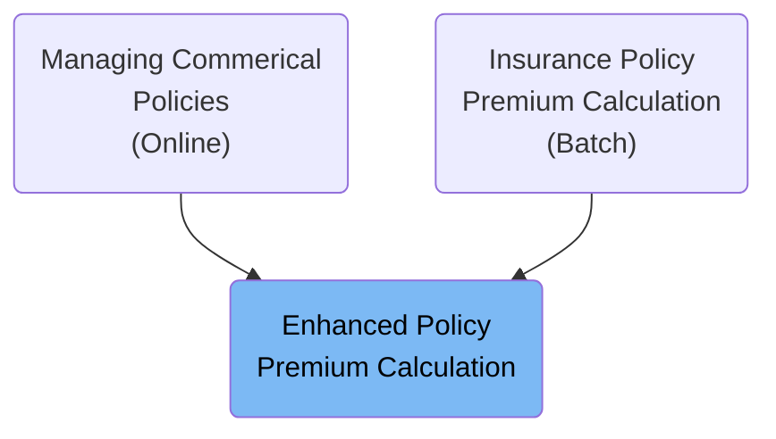

# Technical Overview (Batch Entrypoint)

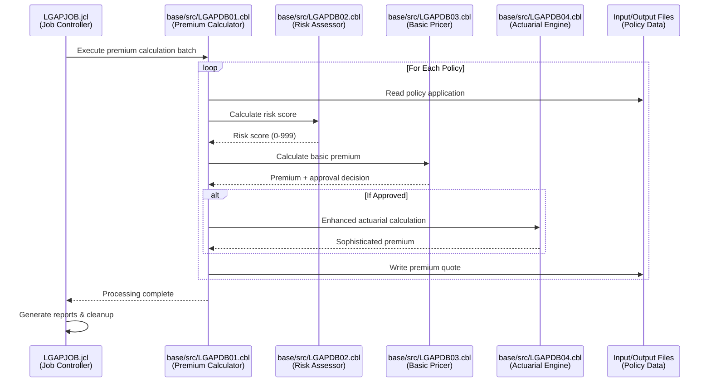

## Input and Output Tables/Files used in the flow

| Table / File Name                                                                                                                                                                                                                                         | Type     | Description                                                          | Usage Mode | Key Fields / Layout Highlights                                                                                                                                                                                                                                                                                                                                                                                                                                                                                                                                                                                                                                                                                                                                                                                                                                                                                                                                                                                                                                                                                                                                                                                                                                                                                                                                                                                                                                                                                                                                                                                                                                                                                                                                                                                                                                                                                                                                                                                                                                                                                                                                                                                                                         |
| --------------------------------------------------------------------------------------------------------------------------------------------------------------------------------------------------------------------------------------------------------- | -------- | -------------------------------------------------------------------- | ---------- | ------------------------------------------------------------------------------------------------------------------------------------------------------------------------------------------------------------------------------------------------------------------------------------------------------------------------------------------------------------------------------------------------------------------------------------------------------------------------------------------------------------------------------------------------------------------------------------------------------------------------------------------------------------------------------------------------------------------------------------------------------------------------------------------------------------------------------------------------------------------------------------------------------------------------------------------------------------------------------------------------------------------------------------------------------------------------------------------------------------------------------------------------------------------------------------------------------------------------------------------------------------------------------------------------------------------------------------------------------------------------------------------------------------------------------------------------------------------------------------------------------------------------------------------------------------------------------------------------------------------------------------------------------------------------------------------------------------------------------------------------------------------------------------------------------------------------------------------------------------------------------------------------------------------------------------------------------------------------------------------------------------------------------------------------------------------------------------------------------------------------------------------------------------------------------------------------------------------------------------------------------ |
| <SwmToken path="/base/src/LGAPDB01.cbl" pos="192:3:5" line-data="           READ INPUT-FILE" repo-id="Z2l0aHViJTNBJTNBY2ljcy1nZW5hcHAtZGVtbyUzQSUzQXN3aW1taW8=" repo-name="cics-genapp-demp">`INPUT-FILE`</SwmToken>                                      | File     | Insurance policy input records for premium calculation               | Input      | File resource                                                                                                                                                                                                                                                                                                                                                                                                                                                                                                                                                                                                                                                                                                                                                                                                                                                                                                                                                                                                                                                                                                                                                                                                                                                                                                                                                                                                                                                                                                                                                                                                                                                                                                                                                                                                                                                                                                                                                                                                                                                                                                                                                                                                                                          |
| <SwmToken path="/base/src/LGAPDB01.cbl" pos="152:5:7" line-data="           OPEN OUTPUT OUTPUT-FILE" repo-id="Z2l0aHViJTNBJTNBY2ljcy1nZW5hcHAtZGVtbyUzQSUzQXN3aW1taW8=" repo-name="cics-genapp-demp">`OUTPUT-FILE`</SwmToken>                             | File     | Calculated insurance premiums and processing results                 | Output     | File resource                                                                                                                                                                                                                                                                                                                                                                                                                                                                                                                                                                                                                                                                                                                                                                                                                                                                                                                                                                                                                                                                                                                                                                                                                                                                                                                                                                                                                                                                                                                                                                                                                                                                                                                                                                                                                                                                                                                                                                                                                                                                                                                                                                                                                                          |
| <SwmToken path="/base/src/LGAPDB01.cbl" pos="113:5:7" line-data="           OPEN INPUT CONFIG-FILE" repo-id="Z2l0aHViJTNBJTNBY2ljcy1nZW5hcHAtZGVtbyUzQSUzQXN3aW1taW8=" repo-name="cics-genapp-demp">`CONFIG-FILE`</SwmToken>                              | File     | Configuration file for maximum risk score and minimum premium amount | Input      | File resource                                                                                                                                                                                                                                                                                                                                                                                                                                                                                                                                                                                                                                                                                                                                                                                                                                                                                                                                                                                                                                                                                                                                                                                                                                                                                                                                                                                                                                                                                                                                                                                                                                                                                                                                                                                                                                                                                                                                                                                                                                                                                                                                                                                                                                          |
| <SwmToken path="/base/src/LGAPDB01.cbl" pos="27:3:5" line-data="           SELECT SUMMARY-FILE ASSIGN TO &#39;SUMMARY.DAT&#39;" repo-id="Z2l0aHViJTNBJTNBY2ljcy1nZW5hcHAtZGVtbyUzQSUzQXN3aW1taW8=" repo-name="cics-genapp-demp">`SUMMARY-FILE`</SwmToken> | File     | File where the output report is saved                                | Output     | File resource                                                                                                                                                                                                                                                                                                                                                                                                                                                                                                                                                                                                                                                                                                                                                                                                                                                                                                                                                                                                                                                                                                                                                                                                                                                                                                                                                                                                                                                                                                                                                                                                                                                                                                                                                                                                                                                                                                                                                                                                                                                                                                                                                                                                                                          |
| <SwmToken path="/base/src/LGAPDB03.cbl" pos="51:3:3" line-data="               FROM RISK_FACTORS" repo-id="Z2l0aHViJTNBJTNBY2ljcy1nZW5hcHAtZGVtbyUzQSUzQXN3aW1taW8=" repo-name="cics-genapp-demp">`RISK_FACTORS`</SwmToken>                               | DB Table | Table including risk factors for different perils                    | Input      | <SwmToken path="/base/src/LGAPDB03.cbl" pos="50:3:3" line-data="               SELECT FACTOR_VALUE INTO :WS-FIRE-FACTOR" repo-id="Z2l0aHViJTNBJTNBY2ljcy1nZW5hcHAtZGVtbyUzQSUzQXN3aW1taW8=" repo-name="cics-genapp-demp">`FACTOR_VALUE`</SwmToken>                                                                                                                                                                                                                                                                                                                                                                                                                                                                                                                                                                                                                                                                                                                                                                                                                                                                                                                                                                                                                                                                                                                                                                                                                                                                                                                                                                                                                                                                                                                                                                                                                                                                                                                                                                                                                                                                                                                                                                                                     |
| <SwmToken path="/base/src/LGAPDB04.cbl" pos="183:3:3" line-data="               FROM RATE_MASTER" repo-id="Z2l0aHViJTNBJTNBY2ljcy1nZW5hcHAtZGVtbyUzQSUzQXN3aW1taW8=" repo-name="cics-genapp-demp">`RATE_MASTER`</SwmToken>                                | DB Table | Stores base rates                                                    | Input      | <SwmToken path="/base/src/LGAPDB04.cbl" pos="181:3:3" line-data="               SELECT BASE_RATE, MIN_PREMIUM, MAX_PREMIUM" repo-id="Z2l0aHViJTNBJTNBY2ljcy1nZW5hcHAtZGVtbyUzQSUzQXN3aW1taW8=" repo-name="cics-genapp-demp">`BASE_RATE`</SwmToken>, <SwmToken path="/base/src/LGAPDB04.cbl" pos="181:6:6" line-data="               SELECT BASE_RATE, MIN_PREMIUM, MAX_PREMIUM" repo-id="Z2l0aHViJTNBJTNBY2ljcy1nZW5hcHAtZGVtbyUzQSUzQXN3aW1taW8=" repo-name="cics-genapp-demp">`MIN_PREMIUM`</SwmToken>, <SwmToken path="/base/src/LGAPDB04.cbl" pos="181:9:9" line-data="               SELECT BASE_RATE, MIN_PREMIUM, MAX_PREMIUM" repo-id="Z2l0aHViJTNBJTNBY2ljcy1nZW5hcHAtZGVtbyUzQSUzQXN3aW1taW8=" repo-name="cics-genapp-demp">`MAX_PREMIUM`</SwmToken>, <SwmToken path="/base/src/LGAPDB04.cbl" pos="184:3:3" line-data="               WHERE TERRITORY = :LK-TERRITORY" repo-id="Z2l0aHViJTNBJTNBY2ljcy1nZW5hcHAtZGVtbyUzQSUzQXN3aW1taW8=" repo-name="cics-genapp-demp">`TERRITORY`</SwmToken>, <SwmToken path="/base/src/LGAPDB04.cbl" pos="185:3:3" line-data="                 AND CONSTRUCTION_TYPE = :LK-CONSTRUCTION-TYPE" repo-id="Z2l0aHViJTNBJTNBY2ljcy1nZW5hcHAtZGVtbyUzQSUzQXN3aW1taW8=" repo-name="cics-genapp-demp">`CONSTRUCTION_TYPE`</SwmToken>, <SwmToken path="/base/src/LGAPDB04.cbl" pos="186:3:3" line-data="                 AND OCCUPANCY_CODE = :LK-OCCUPANCY-CODE" repo-id="Z2l0aHViJTNBJTNBY2ljcy1nZW5hcHAtZGVtbyUzQSUzQXN3aW1taW8=" repo-name="cics-genapp-demp">`OCCUPANCY_CODE`</SwmToken>, <SwmToken path="/base/src/LGAPDB04.cbl" pos="187:3:3" line-data="                 AND PERIL_CODE = &#39;FI&#39;" repo-id="Z2l0aHViJTNBJTNBY2ljcy1nZW5hcHAtZGVtbyUzQSUzQXN3aW1taW8=" repo-name="cics-genapp-demp">`PERIL_CODE`</SwmToken>, <SwmToken path="/base/cntl/lgapjob.jcl" pos="52:3:3" line-data="  WHERE EFFECTIVE_DATE &lt;= CURRENT DATE " repo-id="Z2l0aHViJTNBJTNBY2ljcy1nZW5hcHAtZGVtbyUzQSUzQXN3aW1taW8=" repo-name="cics-genapp-demp">`EFFECTIVE_DATE`</SwmToken>, <SwmToken path="/base/cntl/lgapjob.jcl" pos="53:3:3" line-data="    AND EXPIRY_DATE &gt;= CURRENT DATE;" repo-id="Z2l0aHViJTNBJTNBY2ljcy1nZW5hcHAtZGVtbyUzQSUzQXN3aW1taW8=" repo-name="cics-genapp-demp">`EXPIRY_DATE`</SwmToken> |

# Main Flow

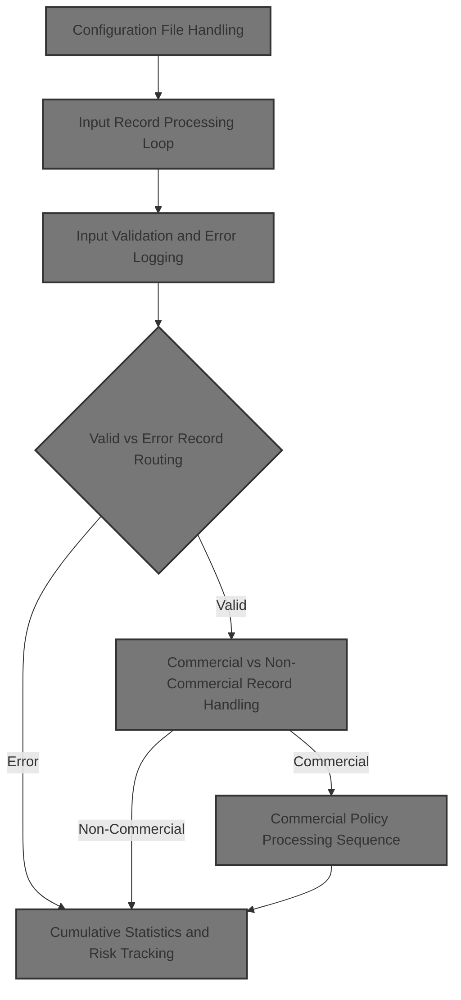

# Startup and Initialization

<SwmSnippet path="/base/src/LGAPDB01.cbl" line="90" repo-id="Z2l0aHViJTNBJTNBY2ljcy1nZW5hcHAtZGVtbyUzQSUzQXN3aW1taW8=">

---

<SwmToken path="/base/src/LGAPDB01.cbl" pos="90:1:1" line-data="       P001." repo-id="Z2l0aHViJTNBJTNBY2ljcy1nZW5hcHAtZGVtbyUzQSUzQXN3aW1taW8=" repo-name="cics-genapp-demp">`P001`</SwmToken> kicks off the whole process: it initializes state, loads config values, opens files, processes records, closes files, generates a summary, and displays stats. We call <SwmToken path="/base/src/LGAPDB01.cbl" pos="92:3:7" line-data="           PERFORM P003-LOAD-CONFIG" repo-id="Z2l0aHViJTNBJTNBY2ljcy1nZW5hcHAtZGVtbyUzQSUzQXN3aW1taW8=" repo-name="cics-genapp-demp">`P003-LOAD-CONFIG`</SwmToken> right after initialization because we need config parameters (like risk score limits and minimum premium) before we can open files or process any records. These config values drive validation and calculation logic downstream.

```cobol
       P001.
           PERFORM P002-INITIALIZE
           PERFORM P003-LOAD-CONFIG
           PERFORM P005-OPEN-FILES
           PERFORM P006-PROCESS-RECORDS
           PERFORM P014-CLOSE-FILES
           PERFORM P015-GENERATE-SUMMARY
           PERFORM P016-DISPLAY-STATS
           STOP RUN.
```

---

</SwmSnippet>

## Configuration File Handling

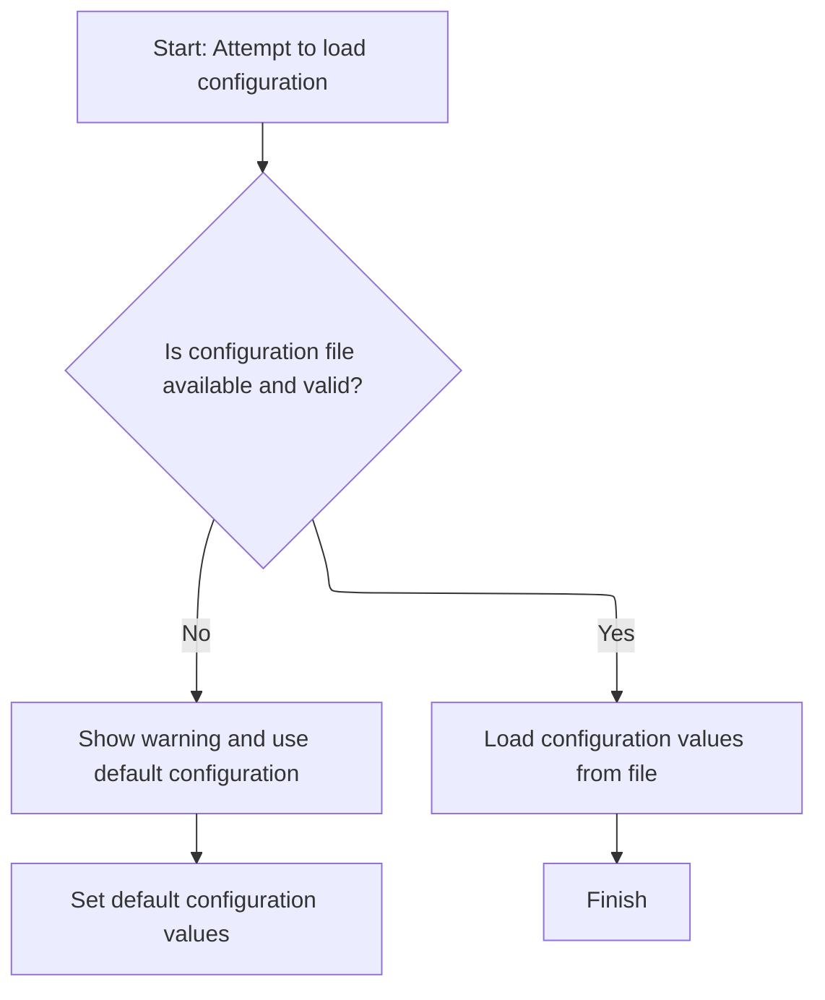

This section governs how the application determines its configuration values at startup, ensuring that the system always has valid configuration parameters to operate, either from a user-provided file or from built-in defaults.

| Category        | Rule Name                        | Description                                                                                                                                                                                                                |
| --------------- | -------------------------------- | -------------------------------------------------------------------------------------------------------------------------------------------------------------------------------------------------------------------------- |
| Data validation | Configuration file status check  | The system must determine the availability and validity of the configuration file based on the configuration status variable, which must indicate a successful status ('00') to proceed with loading values from the file. |
| Business logic  | Load configuration from file     | If the configuration file is available and valid, the system must load all required configuration values from the file for use in subsequent application logic.                                                            |
| Business logic  | Set default configuration values | If the configuration file is not available or invalid, the system must set all configuration values to predefined default values to ensure continued operation.                                                            |

<SwmSnippet path="/base/src/LGAPDB01.cbl" line="112" repo-id="Z2l0aHViJTNBJTNBY2ljcy1nZW5hcHAtZGVtbyUzQSUzQXN3aW1taW8=">

---

<SwmToken path="/base/src/LGAPDB01.cbl" pos="112:1:5" line-data="       P003-LOAD-CONFIG." repo-id="Z2l0aHViJTNBJTNBY2ljcy1nZW5hcHAtZGVtbyUzQSUzQXN3aW1taW8=" repo-name="cics-genapp-demp">`P003-LOAD-CONFIG`</SwmToken> opens the config file and checks if it's available. If not, it sets defaults. If the file is there, it calls <SwmToken path="/base/src/LGAPDB01.cbl" pos="125:1:7" line-data="       P004-READ-CONFIG-VALUES." repo-id="Z2l0aHViJTNBJTNBY2ljcy1nZW5hcHAtZGVtbyUzQSUzQXN3aW1taW8=" repo-name="cics-genapp-demp">`P004-READ-CONFIG-VALUES`</SwmToken> to actually pull out the needed config parameters for use later in the flow.

```cobol
       P003-LOAD-CONFIG.
           OPEN INPUT CONFIG-FILE
           IF NOT CONFIG-OK
               DISPLAY 'Warning: Config file not available - using defaults'
               PERFORM P004-SET-DEFAULTS
           ELSE
               PERFORM P004-READ-CONFIG-VALUES
               CLOSE CONFIG-FILE
           END-IF.
```

---

</SwmSnippet>

## Reading and Assigning Config Parameters

```mermaid
%%{init: {"flowchart": {"defaultRenderer": "elk"}} }%%
flowchart TD
    node1["Read MAX_RISK_SCORE from configuration file"]
    click node1 openCode "base/src/LGAPDB01.cbl:126:127"
    node1 --> node2{"Is configuration valid and numeric?"}
    click node2 openCode "base/src/LGAPDB01.cbl:128:130"
    node2 -->|"Yes"| node3["Update maximum risk score"]
    click node3 openCode "base/src/LGAPDB01.cbl:129:129"
    node2 -->|"No"| node5["Read MIN_PREMIUM from configuration file"]
    node3 --> node5
    click node5 openCode "base/src/LGAPDB01.cbl:132:133"
    node5 --> node6{"Is configuration valid and numeric?"}
    click node6 openCode "base/src/LGAPDB01.cbl:134:136"
    node6 -->|"Yes"| node7["Update minimum premium"]
    click node7 openCode "base/src/LGAPDB01.cbl:135:135"
    node6 -->|"No"| node8["End"]
    click node8 openCode "base/src/LGAPDB01.cbl:136:136"

classDef HeadingStyle fill:#777777,stroke:#333,stroke-width:2px;

%% Swimm:
%% %%{init: {"flowchart": {"defaultRenderer": "elk"}} }%%
%% flowchart TD
%%     node1["Read <SwmToken path="/base/src/LGAPDB01.cbl" pos="126:4:4" line-data="           MOVE &#39;MAX_RISK_SCORE&#39; TO CONFIG-KEY" repo-id="Z2l0aHViJTNBJTNBY2ljcy1nZW5hcHAtZGVtbyUzQSUzQXN3aW1taW8=" repo-name="cics-genapp-demp">`MAX_RISK_SCORE`</SwmToken> from configuration file"]
%%     click node1 openCode "<SwmPath repo-id="Z2l0aHViJTNBJTNBY2ljcy1nZW5hcHAtZGVtbyUzQSUzQXN3aW1taW8=" repo-name="cics-genapp-demp" path="/base/src/LGAPDB01.cbl">`(cics-genapp-demp) base/src/LGAPDB01.cbl`</SwmPath>:126:127"
%%     node1 --> node2{"Is configuration valid and numeric?"}
%%     click node2 openCode "<SwmPath repo-id="Z2l0aHViJTNBJTNBY2ljcy1nZW5hcHAtZGVtbyUzQSUzQXN3aW1taW8=" repo-name="cics-genapp-demp" path="/base/src/LGAPDB01.cbl">`(cics-genapp-demp) base/src/LGAPDB01.cbl`</SwmPath>:128:130"
%%     node2 -->|"Yes"| node3["Update maximum risk score"]
%%     click node3 openCode "<SwmPath repo-id="Z2l0aHViJTNBJTNBY2ljcy1nZW5hcHAtZGVtbyUzQSUzQXN3aW1taW8=" repo-name="cics-genapp-demp" path="/base/src/LGAPDB01.cbl">`(cics-genapp-demp) base/src/LGAPDB01.cbl`</SwmPath>:129:129"
%%     node2 -->|"No"| node5["Read <SwmToken path="/base/src/LGAPDB01.cbl" pos="132:4:4" line-data="           MOVE &#39;MIN_PREMIUM&#39; TO CONFIG-KEY" repo-id="Z2l0aHViJTNBJTNBY2ljcy1nZW5hcHAtZGVtbyUzQSUzQXN3aW1taW8=" repo-name="cics-genapp-demp">`MIN_PREMIUM`</SwmToken> from configuration file"]
%%     node3 --> node5
%%     click node5 openCode "<SwmPath repo-id="Z2l0aHViJTNBJTNBY2ljcy1nZW5hcHAtZGVtbyUzQSUzQXN3aW1taW8=" repo-name="cics-genapp-demp" path="/base/src/LGAPDB01.cbl">`(cics-genapp-demp) base/src/LGAPDB01.cbl`</SwmPath>:132:133"
%%     node5 --> node6{"Is configuration valid and numeric?"}
%%     click node6 openCode "<SwmPath repo-id="Z2l0aHViJTNBJTNBY2ljcy1nZW5hcHAtZGVtbyUzQSUzQXN3aW1taW8=" repo-name="cics-genapp-demp" path="/base/src/LGAPDB01.cbl">`(cics-genapp-demp) base/src/LGAPDB01.cbl`</SwmPath>:134:136"
%%     node6 -->|"Yes"| node7["Update minimum premium"]
%%     click node7 openCode "<SwmPath repo-id="Z2l0aHViJTNBJTNBY2ljcy1nZW5hcHAtZGVtbyUzQSUzQXN3aW1taW8=" repo-name="cics-genapp-demp" path="/base/src/LGAPDB01.cbl">`(cics-genapp-demp) base/src/LGAPDB01.cbl`</SwmPath>:135:135"
%%     node6 -->|"No"| node8["End"]
%%     click node8 openCode "<SwmPath repo-id="Z2l0aHViJTNBJTNBY2ljcy1nZW5hcHAtZGVtbyUzQSUzQXN3aW1taW8=" repo-name="cics-genapp-demp" path="/base/src/LGAPDB01.cbl">`(cics-genapp-demp) base/src/LGAPDB01.cbl`</SwmPath>:136:136"
%% 
%% classDef HeadingStyle fill:#777777,stroke:#333,stroke-width:2px;
```

This section ensures that the application uses up-to-date and valid configuration values for maximum risk score and minimum premium, which are critical for risk assessment and premium calculation. It provides flexibility for business users to adjust these parameters without code changes, while ensuring data integrity.

| Category        | Rule Name                      | Description                                                                                                                                                                                                                                                                                                                                                                                                                                                                                                                                                                                                                                                                                                  |
| --------------- | ------------------------------ | ------------------------------------------------------------------------------------------------------------------------------------------------------------------------------------------------------------------------------------------------------------------------------------------------------------------------------------------------------------------------------------------------------------------------------------------------------------------------------------------------------------------------------------------------------------------------------------------------------------------------------------------------------------------------------------------------------------ |
| Data validation | Configuration value validation | A configuration value is considered valid only if the configuration status is 'OK' and the configuration type is numeric.                                                                                                                                                                                                                                                                                                                                                                                                                                                                                                                                                                                    |
| Business logic  | Maximum risk score assignment  | The maximum risk score used by the application must be set to the value of <SwmToken path="/base/src/LGAPDB01.cbl" pos="126:4:4" line-data="           MOVE &#39;MAX_RISK_SCORE&#39; TO CONFIG-KEY" repo-id="Z2l0aHViJTNBJTNBY2ljcy1nZW5hcHAtZGVtbyUzQSUzQXN3aW1taW8=" repo-name="cics-genapp-demp">`MAX_RISK_SCORE`</SwmToken> from the configuration file if and only if the configuration value is present, valid, and numeric. Otherwise, the default value of 250 is retained.                                                                                                                                                                                                                          |
| Business logic  | Minimum premium assignment     | The minimum premium used by the application must be set to the value of <SwmToken path="/base/src/LGAPDB01.cbl" pos="132:4:4" line-data="           MOVE &#39;MIN_PREMIUM&#39; TO CONFIG-KEY" repo-id="Z2l0aHViJTNBJTNBY2ljcy1nZW5hcHAtZGVtbyUzQSUzQXN3aW1taW8=" repo-name="cics-genapp-demp">`MIN_PREMIUM`</SwmToken> from the configuration file if and only if the configuration value is present, valid, and numeric. Otherwise, the default value of <SwmToken path="/base/src/LGAPDB04.cbl" pos="300:11:13" line-data="           IF WS-EXPOSURE-DENSITY &gt; 500.00" repo-id="Z2l0aHViJTNBJTNBY2ljcy1nZW5hcHAtZGVtbyUzQSUzQXN3aW1taW8=" repo-name="cics-genapp-demp">`500.00`</SwmToken> is retained. |

<SwmSnippet path="/base/src/LGAPDB01.cbl" line="125" repo-id="Z2l0aHViJTNBJTNBY2ljcy1nZW5hcHAtZGVtbyUzQSUzQXN3aW1taW8=">

---

<SwmToken path="/base/src/LGAPDB01.cbl" pos="125:1:7" line-data="       P004-READ-CONFIG-VALUES." repo-id="Z2l0aHViJTNBJTNBY2ljcy1nZW5hcHAtZGVtbyUzQSUzQXN3aW1taW8=" repo-name="cics-genapp-demp">`P004-READ-CONFIG-VALUES`</SwmToken> reads <SwmToken path="/base/src/LGAPDB01.cbl" pos="126:4:4" line-data="           MOVE &#39;MAX_RISK_SCORE&#39; TO CONFIG-KEY" repo-id="Z2l0aHViJTNBJTNBY2ljcy1nZW5hcHAtZGVtbyUzQSUzQXN3aW1taW8=" repo-name="cics-genapp-demp">`MAX_RISK_SCORE`</SwmToken> from config, checks it's valid and numeric, and assigns it if so.

```cobol
       P004-READ-CONFIG-VALUES.
           MOVE 'MAX_RISK_SCORE' TO CONFIG-KEY
           READ CONFIG-FILE
           IF CONFIG-OK AND NUMERIC-CONFIG
               MOVE FUNCTION NUMVAL(CONFIG-VALUE) TO WS-MAX-RISK-SCORE
           END-IF
```

---

</SwmSnippet>

<SwmSnippet path="/base/src/LGAPDB01.cbl" line="132" repo-id="Z2l0aHViJTNBJTNBY2ljcy1nZW5hcHAtZGVtbyUzQSUzQXN3aW1taW8=">

---

After reading <SwmToken path="/base/src/LGAPDB01.cbl" pos="126:4:4" line-data="           MOVE &#39;MAX_RISK_SCORE&#39; TO CONFIG-KEY" repo-id="Z2l0aHViJTNBJTNBY2ljcy1nZW5hcHAtZGVtbyUzQSUzQXN3aW1taW8=" repo-name="cics-genapp-demp">`MAX_RISK_SCORE`</SwmToken>, we do the same for <SwmToken path="/base/src/LGAPDB01.cbl" pos="132:4:4" line-data="           MOVE &#39;MIN_PREMIUM&#39; TO CONFIG-KEY" repo-id="Z2l0aHViJTNBJTNBY2ljcy1nZW5hcHAtZGVtbyUzQSUzQXN3aW1taW8=" repo-name="cics-genapp-demp">`MIN_PREMIUM`</SwmToken>: set the key, read, and assign if valid and numeric. These two config values are now set for use in validation and premium logic downstream.

```cobol
           MOVE 'MIN_PREMIUM' TO CONFIG-KEY
           READ CONFIG-FILE
           IF CONFIG-OK AND NUMERIC-CONFIG
               MOVE FUNCTION NUMVAL(CONFIG-VALUE) TO WS-MIN-PREMIUM
           END-IF.
```

---

</SwmSnippet>

## File Preparation and Setup

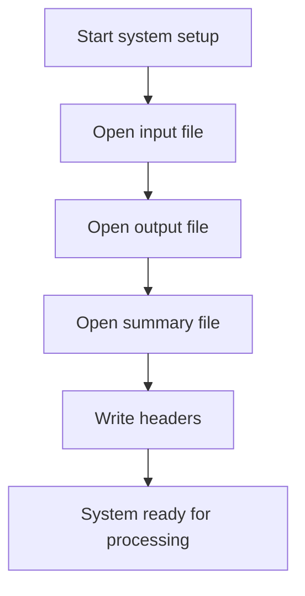

The main product role of this section is to ensure that all files required for processing are properly opened and initialized, and that output files are structured with headers to support accurate and organized downstream processing.

| Category        | Rule Name                     | Description                                                                                                                               |
| --------------- | ----------------------------- | ----------------------------------------------------------------------------------------------------------------------------------------- |
| Data validation | File readiness requirement    | All required files (input, output, summary) must be successfully opened before any data processing can begin.                             |
| Data validation | System readiness confirmation | The system must confirm readiness for processing only after all files are open and headers are written, ensuring no partial setup occurs. |
| Business logic  | Output header enforcement     | Headers must be written to output files to ensure that all subsequent data is correctly structured and easily interpretable.              |

<SwmSnippet path="/base/src/LGAPDB01.cbl" line="138" repo-id="Z2l0aHViJTNBJTNBY2ljcy1nZW5hcHAtZGVtbyUzQSUzQXN3aW1taW8=">

---

<SwmToken path="/base/src/LGAPDB01.cbl" pos="138:1:5" line-data="       P005-OPEN-FILES." repo-id="Z2l0aHViJTNBJTNBY2ljcy1nZW5hcHAtZGVtbyUzQSUzQXN3aW1taW8=" repo-name="cics-genapp-demp">`P005-OPEN-FILES`</SwmToken> opens all files and writes headers so output is structured for later steps.

```cobol
       P005-OPEN-FILES.
           PERFORM P005A-OPEN-INPUT
           PERFORM P005B-OPEN-OUTPUT
           PERFORM P005C-OPEN-SUMMARY
           PERFORM P005D-WRITE-HEADERS.
```

---

</SwmSnippet>

# Input Record Processing Loop

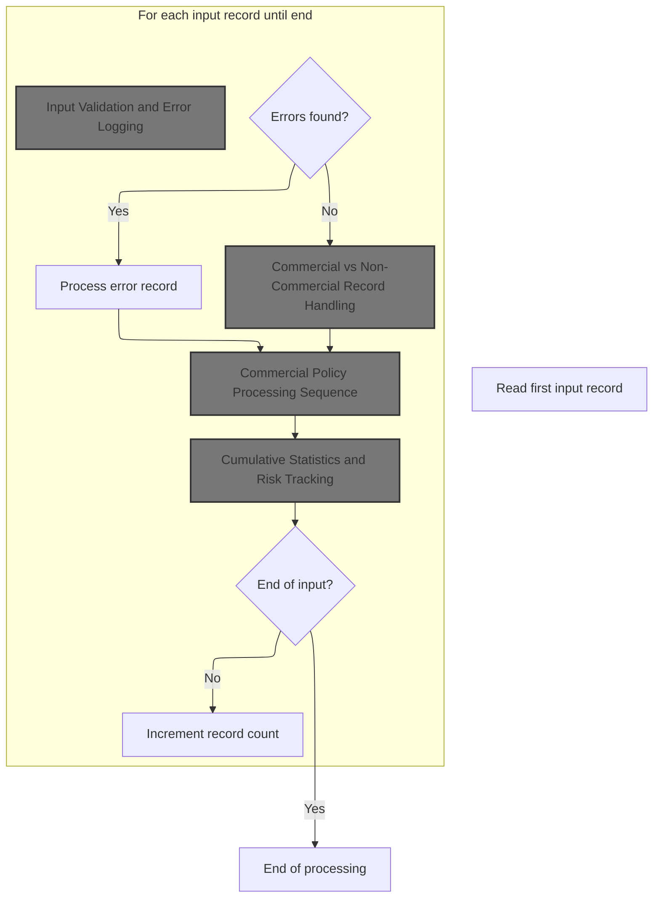

This section governs the main loop for processing input records, ensuring each record is validated, categorized, and processed according to business rules for commercial and non-commercial insurance policies. It also manages error handling and cumulative statistics tracking.

| Category        | Rule Name                        | Description                                                                                                                                                                             |
| --------------- | -------------------------------- | --------------------------------------------------------------------------------------------------------------------------------------------------------------------------------------- |
| Data validation | Input record validation          | Each input record must be validated for correctness before any business processing occurs. Records failing validation are logged as errors and excluded from further policy processing. |
| Data validation | End of input detection           | Processing must continue until the end-of-file condition is reached, as indicated by the input status value '10'.                                                                       |
| Business logic  | Record counting                  | A running count of all input records processed must be maintained, starting from zero and incremented for each record read.                                                             |
| Business logic  | Commercial record processing     | Records identified as commercial must be processed using the commercial policy sequence, which includes premium calculation, risk scoring, and actuarial analysis.                      |
| Business logic  | Non-commercial record processing | Non-commercial records must be processed using the non-commercial policy sequence, which may have different premium and risk rules than commercial records.                             |
| Business logic  | Cumulative statistics tracking   | Cumulative statistics must be updated after each record is processed, including total processed records, errors, warnings, and rejected records.                                        |

<SwmSnippet path="/base/src/LGAPDB01.cbl" line="178" repo-id="Z2l0aHViJTNBJTNBY2ljcy1nZW5hcHAtZGVtbyUzQSUzQXN3aW1taW8=">

---

<SwmToken path="/base/src/LGAPDB01.cbl" pos="94:3:7" line-data="           PERFORM P006-PROCESS-RECORDS" repo-id="Z2l0aHViJTNBJTNBY2ljcy1nZW5hcHAtZGVtbyUzQSUzQXN3aW1taW8=" repo-name="cics-genapp-demp">`P006-PROCESS-RECORDS`</SwmToken> kicks off by reading input to start the record loop.

```cobol
       P006-PROCESS-RECORDS.
           PERFORM P007-READ-INPUT
```

---

</SwmSnippet>

<SwmSnippet path="/base/src/LGAPDB01.cbl" line="180" repo-id="Z2l0aHViJTNBJTNBY2ljcy1nZW5hcHAtZGVtbyUzQSUzQXN3aW1taW8=">

---

After reading each input record, we increment the record count and call <SwmToken path="/base/src/LGAPDB01.cbl" pos="182:3:9" line-data="               PERFORM P008-VALIDATE-INPUT-RECORD" repo-id="Z2l0aHViJTNBJTNBY2ljcy1nZW5hcHAtZGVtbyUzQSUzQXN3aW1taW8=" repo-name="cics-genapp-demp">`P008-VALIDATE-INPUT-RECORD`</SwmToken> to check the record's validity before doing anything else with it.

```cobol
           PERFORM UNTIL INPUT-EOF
               ADD 1 TO WS-REC-CNT
               PERFORM P008-VALIDATE-INPUT-RECORD
```

---

</SwmSnippet>

## Input Validation and Error Logging

```mermaid
%%{init: {"flowchart": {"defaultRenderer": "elk"}} }%%
flowchart TD
    node1["Start input record validation"]
    click node1 openCode "base/src/LGAPDB01.cbl:195:196"
    node1 --> node2{"Is policy type Commercial, Personal, or Farm?"}
    click node2 openCode "base/src/LGAPDB01.cbl:198:204"
    node2 -->|"No"| node3["Record not accepted: Invalid policy type"]
    click node3 openCode "base/src/LGAPDB01.cbl:201:204"
    node2 -->|"Yes"| node4{"Is customer number provided?"}
    click node4 openCode "base/src/LGAPDB01.cbl:206:210"
    node4 -->|"No"| node5["Record not accepted: Customer number required"]
    click node5 openCode "base/src/LGAPDB01.cbl:207:210"
    node4 -->|"Yes"| node6{"Is building or contents coverage limit > 0?"}
    click node6 openCode "base/src/LGAPDB01.cbl:212:217"
    node6 -->|"No"| node7["Record not accepted: At least one coverage limit required"]
    click node7 openCode "base/src/LGAPDB01.cbl:214:217"
    node6 -->|"Yes"| node8{"Does total coverage (building + contents + BI) exceed Total Insured Value ($50,000,000)?"}
    click node8 openCode "base/src/LGAPDB01.cbl:219:224"
    node8 -->|"Yes"| node9["Warning: Coverage exceeds maximum allowed, record accepted"]
    click node9 openCode "base/src/LGAPDB01.cbl:221:224"
    node8 -->|"No"| node10["Record accepted"]
    click node10 openCode "base/src/LGAPDB01.cbl:195:224"

classDef HeadingStyle fill:#777777,stroke:#333,stroke-width:2px;

%% Swimm:
%% %%{init: {"flowchart": {"defaultRenderer": "elk"}} }%%
%% flowchart TD
%%     node1["Start input record validation"]
%%     click node1 openCode "<SwmPath repo-id="Z2l0aHViJTNBJTNBY2ljcy1nZW5hcHAtZGVtbyUzQSUzQXN3aW1taW8=" repo-name="cics-genapp-demp" path="/base/src/LGAPDB01.cbl">`(cics-genapp-demp) base/src/LGAPDB01.cbl`</SwmPath>:195:196"
%%     node1 --> node2{"Is policy type Commercial, Personal, or Farm?"}
%%     click node2 openCode "<SwmPath repo-id="Z2l0aHViJTNBJTNBY2ljcy1nZW5hcHAtZGVtbyUzQSUzQXN3aW1taW8=" repo-name="cics-genapp-demp" path="/base/src/LGAPDB01.cbl">`(cics-genapp-demp) base/src/LGAPDB01.cbl`</SwmPath>:198:204"
%%     node2 -->|"No"| node3["Record not accepted: Invalid policy type"]
%%     click node3 openCode "<SwmPath repo-id="Z2l0aHViJTNBJTNBY2ljcy1nZW5hcHAtZGVtbyUzQSUzQXN3aW1taW8=" repo-name="cics-genapp-demp" path="/base/src/LGAPDB01.cbl">`(cics-genapp-demp) base/src/LGAPDB01.cbl`</SwmPath>:201:204"
%%     node2 -->|"Yes"| node4{"Is customer number provided?"}
%%     click node4 openCode "<SwmPath repo-id="Z2l0aHViJTNBJTNBY2ljcy1nZW5hcHAtZGVtbyUzQSUzQXN3aW1taW8=" repo-name="cics-genapp-demp" path="/base/src/LGAPDB01.cbl">`(cics-genapp-demp) base/src/LGAPDB01.cbl`</SwmPath>:206:210"
%%     node4 -->|"No"| node5["Record not accepted: Customer number required"]
%%     click node5 openCode "<SwmPath repo-id="Z2l0aHViJTNBJTNBY2ljcy1nZW5hcHAtZGVtbyUzQSUzQXN3aW1taW8=" repo-name="cics-genapp-demp" path="/base/src/LGAPDB01.cbl">`(cics-genapp-demp) base/src/LGAPDB01.cbl`</SwmPath>:207:210"
%%     node4 -->|"Yes"| node6{"Is building or contents coverage limit > 0?"}
%%     click node6 openCode "<SwmPath repo-id="Z2l0aHViJTNBJTNBY2ljcy1nZW5hcHAtZGVtbyUzQSUzQXN3aW1taW8=" repo-name="cics-genapp-demp" path="/base/src/LGAPDB01.cbl">`(cics-genapp-demp) base/src/LGAPDB01.cbl`</SwmPath>:212:217"
%%     node6 -->|"No"| node7["Record not accepted: At least one coverage limit required"]
%%     click node7 openCode "<SwmPath repo-id="Z2l0aHViJTNBJTNBY2ljcy1nZW5hcHAtZGVtbyUzQSUzQXN3aW1taW8=" repo-name="cics-genapp-demp" path="/base/src/LGAPDB01.cbl">`(cics-genapp-demp) base/src/LGAPDB01.cbl`</SwmPath>:214:217"
%%     node6 -->|"Yes"| node8{"Does total coverage (building + contents + BI) exceed Total Insured Value ($50,000,000)?"}
%%     click node8 openCode "<SwmPath repo-id="Z2l0aHViJTNBJTNBY2ljcy1nZW5hcHAtZGVtbyUzQSUzQXN3aW1taW8=" repo-name="cics-genapp-demp" path="/base/src/LGAPDB01.cbl">`(cics-genapp-demp) base/src/LGAPDB01.cbl`</SwmPath>:219:224"
%%     node8 -->|"Yes"| node9["Warning: Coverage exceeds maximum allowed, record accepted"]
%%     click node9 openCode "<SwmPath repo-id="Z2l0aHViJTNBJTNBY2ljcy1nZW5hcHAtZGVtbyUzQSUzQXN3aW1taW8=" repo-name="cics-genapp-demp" path="/base/src/LGAPDB01.cbl">`(cics-genapp-demp) base/src/LGAPDB01.cbl`</SwmPath>:221:224"
%%     node8 -->|"No"| node10["Record accepted"]
%%     click node10 openCode "<SwmPath repo-id="Z2l0aHViJTNBJTNBY2ljcy1nZW5hcHAtZGVtbyUzQSUzQXN3aW1taW8=" repo-name="cics-genapp-demp" path="/base/src/LGAPDB01.cbl">`(cics-genapp-demp) base/src/LGAPDB01.cbl`</SwmPath>:195:224"
%% 
%% classDef HeadingStyle fill:#777777,stroke:#333,stroke-width:2px;
```

This section ensures that only valid insurance policy records are accepted for further processing by enforcing business rules on policy type, customer number, coverage limits, and total insured value. Errors and warnings are logged for each record to support downstream error handling and reporting.

| Category        | Rule Name                     | Description                                                                                                                                                                      |
| --------------- | ----------------------------- | -------------------------------------------------------------------------------------------------------------------------------------------------------------------------------- |
| Data validation | Valid policy type requirement | Only records with a policy type of Commercial ('C'), Personal ('P'), or Farm ('F') are accepted. Any other policy type is considered invalid and the record is rejected.         |
| Data validation | Customer number required      | A customer number must be provided for every input record. Records without a customer number are rejected.                                                                       |
| Data validation | Minimum coverage limit        | At least one coverage limit (building or contents) must be greater than zero for a record to be accepted. Records with both limits at zero are rejected.                         |
| Business logic  | Maximum TIV warning           | If the sum of building, contents, and business interruption coverage exceeds the Total Insured Value (TIV) of $50,000,000, a warning is logged but the record is still accepted. |

<SwmSnippet path="/base/src/LGAPDB01.cbl" line="195" repo-id="Z2l0aHViJTNBJTNBY2ljcy1nZW5hcHAtZGVtbyUzQSUzQXN3aW1taW8=">

---

In <SwmToken path="/base/src/LGAPDB01.cbl" pos="195:1:7" line-data="       P008-VALIDATE-INPUT-RECORD." repo-id="Z2l0aHViJTNBJTNBY2ljcy1nZW5hcHAtZGVtbyUzQSUzQXN3aW1taW8=" repo-name="cics-genapp-demp">`P008-VALIDATE-INPUT-RECORD`</SwmToken>, we check if the policy type is valid. If not, we call <SwmToken path="/base/src/LGAPDB01.cbl" pos="226:1:5" line-data="       P008A-LOG-ERROR." repo-id="Z2l0aHViJTNBJTNBY2ljcy1nZW5hcHAtZGVtbyUzQSUzQXN3aW1taW8=" repo-name="cics-genapp-demp">`P008A-LOG-ERROR`</SwmToken> to record the issue so the record gets flagged for error handling.

```cobol
       P008-VALIDATE-INPUT-RECORD.
           INITIALIZE WS-ERROR-HANDLING
           
           IF NOT COMMERCIAL-POLICY AND 
              NOT PERSONAL-POLICY AND 
              NOT FARM-POLICY
               PERFORM P008A-LOG-ERROR WITH 
                   'POL001' 'F' 'IN-POLICY-TYPE' 
                   'Invalid Policy Type'
           END-IF
```

---

</SwmSnippet>

<SwmSnippet path="/base/src/LGAPDB01.cbl" line="226" repo-id="Z2l0aHViJTNBJTNBY2ljcy1nZW5hcHAtZGVtbyUzQSUzQXN3aW1taW8=">

---

<SwmToken path="/base/src/LGAPDB01.cbl" pos="226:1:5" line-data="       P008A-LOG-ERROR." repo-id="Z2l0aHViJTNBJTNBY2ljcy1nZW5hcHAtZGVtbyUzQSUzQXN3aW1taW8=" repo-name="cics-genapp-demp">`P008A-LOG-ERROR`</SwmToken> bumps the error count, uses it as an index, and stores error details in parallel arrays. This lets us track up to 20 errors per record for later handling.

```cobol
       P008A-LOG-ERROR.
           ADD 1 TO WS-ERROR-COUNT
           SET ERR-IDX TO WS-ERROR-COUNT
           MOVE WS-ERROR-CODE TO WS-ERROR-CODE (ERR-IDX)
           MOVE WS-ERROR-SEVERITY TO WS-ERROR-SEVERITY (ERR-IDX)
           MOVE WS-ERROR-FIELD TO WS-ERROR-FIELD (ERR-IDX)
           MOVE WS-ERROR-MESSAGE TO WS-ERROR-MESSAGE (ERR-IDX).
```

---

</SwmSnippet>

<SwmSnippet path="/base/src/LGAPDB01.cbl" line="206" repo-id="Z2l0aHViJTNBJTNBY2ljcy1nZW5hcHAtZGVtbyUzQSUzQXN3aW1taW8=">

---

Back in <SwmToken path="/base/src/LGAPDB01.cbl" pos="195:1:7" line-data="       P008-VALIDATE-INPUT-RECORD." repo-id="Z2l0aHViJTNBJTNBY2ljcy1nZW5hcHAtZGVtbyUzQSUzQXN3aW1taW8=" repo-name="cics-genapp-demp">`P008-VALIDATE-INPUT-RECORD`</SwmToken>, after logging an error for invalid policy type, we check if the customer number is missing and log another error if needed. Each error logged increases the error count, which affects how the record is handled later.

```cobol
           IF IN-CUSTOMER-NUM = SPACES
               PERFORM P008A-LOG-ERROR WITH 
                   'CUS001' 'F' 'IN-CUSTOMER-NUM' 
                   'Customer Number Required'
           END-IF
```

---

</SwmSnippet>

<SwmSnippet path="/base/src/LGAPDB01.cbl" line="212" repo-id="Z2l0aHViJTNBJTNBY2ljcy1nZW5hcHAtZGVtbyUzQSUzQXN3aW1taW8=">

---

After checking customer number, we validate coverage limits. If both building and contents limits are zero, we log another error. This stacks up errors for the record, making sure only valid records get processed further.

```cobol
           IF IN-BUILDING-LIMIT = ZERO AND 
              IN-CONTENTS-LIMIT = ZERO
               PERFORM P008A-LOG-ERROR WITH 
                   'COV001' 'F' 'COVERAGE-LIMITS' 
                   'At least one coverage limit required'
           END-IF
```

---

</SwmSnippet>

<SwmSnippet path="/base/src/LGAPDB01.cbl" line="219" repo-id="Z2l0aHViJTNBJTNBY2ljcy1nZW5hcHAtZGVtbyUzQSUzQXN3aW1taW8=">

---

Finally in <SwmToken path="/base/src/LGAPDB01.cbl" pos="195:1:7" line-data="       P008-VALIDATE-INPUT-RECORD." repo-id="Z2l0aHViJTNBJTNBY2ljcy1nZW5hcHAtZGVtbyUzQSUzQXN3aW1taW8=" repo-name="cics-genapp-demp">`P008-VALIDATE-INPUT-RECORD`</SwmToken>, we check if total coverage exceeds the max TIV and log a warning if it does. At this point, all errors and warnings for the record are logged and ready for downstream handling.

```cobol
           IF IN-BUILDING-LIMIT + IN-CONTENTS-LIMIT + 
              IN-BI-LIMIT > WS-MAX-TIV
               PERFORM P008A-LOG-ERROR WITH 
                   'COV002' 'W' 'COVERAGE-LIMITS' 
                   'Total coverage exceeds maximum TIV'
           END-IF.
```

---

</SwmSnippet>

## Valid vs Error Record Routing

<SwmSnippet path="/base/src/LGAPDB01.cbl" line="183" repo-id="Z2l0aHViJTNBJTNBY2ljcy1nZW5hcHAtZGVtbyUzQSUzQXN3aW1taW8=">

---

Back in <SwmToken path="/base/src/LGAPDB01.cbl" pos="94:3:7" line-data="           PERFORM P006-PROCESS-RECORDS" repo-id="Z2l0aHViJTNBJTNBY2ljcy1nZW5hcHAtZGVtbyUzQSUzQXN3aW1taW8=" repo-name="cics-genapp-demp">`P006-PROCESS-RECORDS`</SwmToken>, after validation, we check the error count. If there are no errors, we process the record as valid by calling <SwmToken path="/base/src/LGAPDB01.cbl" pos="234:1:7" line-data="       P009-PROCESS-VALID-RECORD." repo-id="Z2l0aHViJTNBJTNBY2ljcy1nZW5hcHAtZGVtbyUzQSUzQXN3aW1taW8=" repo-name="cics-genapp-demp">`P009-PROCESS-VALID-RECORD`</SwmToken>. If there are errors, we route it to error handling instead.

```cobol
               IF WS-ERROR-COUNT = ZERO
                   PERFORM P009-PROCESS-VALID-RECORD
               ELSE
                   PERFORM P010-PROCESS-ERROR-RECORD
               END-IF
```

---

</SwmSnippet>

## Commercial vs Non-Commercial Record Handling

<SwmSnippet path="/base/src/LGAPDB01.cbl" line="234" repo-id="Z2l0aHViJTNBJTNBY2ljcy1nZW5hcHAtZGVtbyUzQSUzQXN3aW1taW8=">

---

<SwmToken path="/base/src/LGAPDB01.cbl" pos="234:1:7" line-data="       P009-PROCESS-VALID-RECORD." repo-id="Z2l0aHViJTNBJTNBY2ljcy1nZW5hcHAtZGVtbyUzQSUzQXN3aW1taW8=" repo-name="cics-genapp-demp">`P009-PROCESS-VALID-RECORD`</SwmToken> checks if the policy is commercial. If so, it calls <SwmToken path="/base/src/LGAPDB01.cbl" pos="236:3:7" line-data="               PERFORM P011-PROCESS-COMMERCIAL" repo-id="Z2l0aHViJTNBJTNBY2ljcy1nZW5hcHAtZGVtbyUzQSUzQXN3aW1taW8=" repo-name="cics-genapp-demp">`P011-PROCESS-COMMERCIAL`</SwmToken> and bumps the processed count. Otherwise, it calls <SwmToken path="/base/src/LGAPDB01.cbl" pos="239:3:9" line-data="               PERFORM P012-PROCESS-NON-COMMERCIAL" repo-id="Z2l0aHViJTNBJTNBY2ljcy1nZW5hcHAtZGVtbyUzQSUzQXN3aW1taW8=" repo-name="cics-genapp-demp">`P012-PROCESS-NON-COMMERCIAL`</SwmToken> and bumps the error count. This splits the flow based on policy type.

```cobol
       P009-PROCESS-VALID-RECORD.
           IF COMMERCIAL-POLICY
               PERFORM P011-PROCESS-COMMERCIAL
               ADD 1 TO WS-PROC-CNT
           ELSE
               PERFORM P012-PROCESS-NON-COMMERCIAL
               ADD 1 TO WS-ERR-CNT
           END-IF.
```

---

</SwmSnippet>

## Commercial Policy Processing Sequence

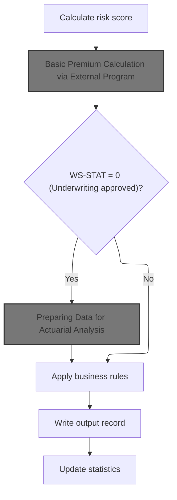

This section governs the sequence for processing commercial insurance policies, ensuring that risk is assessed, premiums are calculated, underwriting decisions are respected, and all relevant business rules are applied before finalizing the policy record.

| Category        | Rule Name                                | Description                                                                                                                                                                                                                                                                                                                                            |
| --------------- | ---------------------------------------- | ------------------------------------------------------------------------------------------------------------------------------------------------------------------------------------------------------------------------------------------------------------------------------------------------------------------------------------------------------ |
| Data validation | Mandatory risk scoring                   | A risk score must be calculated for every commercial policy before any premium calculation is performed.                                                                                                                                                                                                                                               |
| Data validation | Output record requirement                | Every processed policy record must be written to the output, regardless of underwriting decision.                                                                                                                                                                                                                                                      |
| Business logic  | Premium calculation based on risk        | The basic premium for a policy must be calculated using the most current risk score and configuration-driven parameters.                                                                                                                                                                                                                               |
| Business logic  | Actuarial analysis for approved policies | If the underwriting decision is 'approved' (<SwmToken path="/base/src/LGAPDB01.cbl" pos="369:3:5" line-data="           EVALUATE WS-STAT" repo-id="Z2l0aHViJTNBJTNBY2ljcy1nZW5hcHAtZGVtbyUzQSUzQXN3aW1taW8=" repo-name="cics-genapp-demp">`WS-STAT`</SwmToken> = 0), the policy data must be prepared for actuarial analysis.                          |
| Business logic  | Conditional business rule application    | If the underwriting decision is not 'approved' (<SwmToken path="/base/src/LGAPDB01.cbl" pos="369:3:5" line-data="           EVALUATE WS-STAT" repo-id="Z2l0aHViJTNBJTNBY2ljcy1nZW5hcHAtZGVtbyUzQSUzQXN3aW1taW8=" repo-name="cics-genapp-demp">`WS-STAT`</SwmToken> ≠ 0), additional business rules must be applied before the policy can be finalized. |
| Business logic  | Statistics update after processing       | Statistics must be updated after each policy is processed to ensure accurate reporting and analytics.                                                                                                                                                                                                                                                  |

<SwmSnippet path="/base/src/LGAPDB01.cbl" line="258" repo-id="Z2l0aHViJTNBJTNBY2ljcy1nZW5hcHAtZGVtbyUzQSUzQXN3aW1taW8=">

---

In <SwmToken path="/base/src/LGAPDB01.cbl" pos="236:3:7" line-data="               PERFORM P011-PROCESS-COMMERCIAL" repo-id="Z2l0aHViJTNBJTNBY2ljcy1nZW5hcHAtZGVtbyUzQSUzQXN3aW1taW8=" repo-name="cics-genapp-demp">`P011-PROCESS-COMMERCIAL`</SwmToken>, we first calculate the risk score, then call <SwmToken path="/base/src/LGAPDB01.cbl" pos="260:3:9" line-data="           PERFORM P011B-BASIC-PREMIUM-CALC" repo-id="Z2l0aHViJTNBJTNBY2ljcy1nZW5hcHAtZGVtbyUzQSUzQXN3aW1taW8=" repo-name="cics-genapp-demp">`P011B-BASIC-PREMIUM-CALC`</SwmToken> to compute the basic premium. The risk score feeds directly into the premium calculation.

```cobol
       P011-PROCESS-COMMERCIAL.
           PERFORM P011A-CALCULATE-RISK-SCORE
           PERFORM P011B-BASIC-PREMIUM-CALC
```

---

</SwmSnippet>

### Basic Premium Calculation via External Program

<SwmSnippet path="/base/src/LGAPDB01.cbl" line="275" repo-id="Z2l0aHViJTNBJTNBY2ljcy1nZW5hcHAtZGVtbyUzQSUzQXN3aW1taW8=">

---

We call <SwmToken path="/base/src/LGAPDB01.cbl" pos="276:4:4" line-data="           CALL &#39;LGAPDB03&#39; USING WS-BASE-RISK-SCR, IN-FIRE-PERIL, " repo-id="Z2l0aHViJTNBJTNBY2ljcy1nZW5hcHAtZGVtbyUzQSUzQXN3aW1taW8=" repo-name="cics-genapp-demp">`LGAPDB03`</SwmToken> to get premium values, then use those results in the next steps.

```cobol
       P011B-BASIC-PREMIUM-CALC.
           CALL 'LGAPDB03' USING WS-BASE-RISK-SCR, IN-FIRE-PERIL, 
                                IN-CRIME-PERIL, IN-FLOOD-PERIL, 
                                IN-WEATHER-PERIL, WS-STAT,
                                WS-STAT-DESC, WS-REJ-RSN, WS-FR-PREM,
                                WS-CR-PREM, WS-FL-PREM, WS-WE-PREM,
                                WS-TOT-PREM, WS-DISC-FACT.
```

---

</SwmSnippet>

### Premium Calculation Logic

```mermaid
%%{init: {"flowchart": {"defaultRenderer": "elk"}} }%%
flowchart TD
  node1["Retrieve risk factors for FIRE, CRIME, FLOOD, WEATHER"] --> node2["Determine risk verdict"]
  click node1 openCode "base/src/LGAPDB03.cbl:48:71"
  node2{"Risk score > 200?"}
  click node2 openCode "base/src/LGAPDB03.cbl:73:90"
  node2 -->|"Yes"| node3["Status: Rejected"]
  click node3 openCode "base/src/LGAPDB03.cbl:74:78"
  node2 -->|"No"| node4{"Risk score > 150?"}
  click node4 openCode "base/src/LGAPDB03.cbl:80:84"
  node4 -->|"Yes"| node5["Status: Pending"]
  click node5 openCode "base/src/LGAPDB03.cbl:81:83"
  node4 -->|"No"| node6["Status: Approved"]
  click node6 openCode "base/src/LGAPDB03.cbl:86:88"
  node3 --> node7["Calculate premiums for all perils"]
  node5 --> node7
  node6 --> node7
  click node7 openCode "base/src/LGAPDB03.cbl:92:120"
  node7{"All perils covered?"}
  click node7 openCode "base/src/LGAPDB03.cbl:95:100"
  node7 -->|"Yes (Discount 0.90)"| node8["Apply 10% discount"]
  click node8 openCode "base/src/LGAPDB03.cbl:99:100"
  node7 -->|"No (Discount 1.00)"| node9["No discount"]
  click node9 openCode "base/src/LGAPDB03.cbl:93:94"
  node8 --> node10["Compute total premium"]
  node9 --> node10["Compute total premium"]
  click node10 openCode "base/src/LGAPDB03.cbl:102:120"

classDef HeadingStyle fill:#777777,stroke:#333,stroke-width:2px;

%% Swimm:
%% %%{init: {"flowchart": {"defaultRenderer": "elk"}} }%%
%% flowchart TD
%%   node1["Retrieve risk factors for FIRE, CRIME, FLOOD, WEATHER"] --> node2["Determine risk verdict"]
%%   click node1 openCode "<SwmPath repo-id="Z2l0aHViJTNBJTNBY2ljcy1nZW5hcHAtZGVtbyUzQSUzQXN3aW1taW8=" repo-name="cics-genapp-demp" path="/base/src/LGAPDB03.cbl">`(cics-genapp-demp) base/src/LGAPDB03.cbl`</SwmPath>:48:71"
%%   node2{"Risk score > 200?"}
%%   click node2 openCode "<SwmPath repo-id="Z2l0aHViJTNBJTNBY2ljcy1nZW5hcHAtZGVtbyUzQSUzQXN3aW1taW8=" repo-name="cics-genapp-demp" path="/base/src/LGAPDB03.cbl">`(cics-genapp-demp) base/src/LGAPDB03.cbl`</SwmPath>:73:90"
%%   node2 -->|"Yes"| node3["Status: Rejected"]
%%   click node3 openCode "<SwmPath repo-id="Z2l0aHViJTNBJTNBY2ljcy1nZW5hcHAtZGVtbyUzQSUzQXN3aW1taW8=" repo-name="cics-genapp-demp" path="/base/src/LGAPDB03.cbl">`(cics-genapp-demp) base/src/LGAPDB03.cbl`</SwmPath>:74:78"
%%   node2 -->|"No"| node4{"Risk score > 150?"}
%%   click node4 openCode "<SwmPath repo-id="Z2l0aHViJTNBJTNBY2ljcy1nZW5hcHAtZGVtbyUzQSUzQXN3aW1taW8=" repo-name="cics-genapp-demp" path="/base/src/LGAPDB03.cbl">`(cics-genapp-demp) base/src/LGAPDB03.cbl`</SwmPath>:80:84"
%%   node4 -->|"Yes"| node5["Status: Pending"]
%%   click node5 openCode "<SwmPath repo-id="Z2l0aHViJTNBJTNBY2ljcy1nZW5hcHAtZGVtbyUzQSUzQXN3aW1taW8=" repo-name="cics-genapp-demp" path="/base/src/LGAPDB03.cbl">`(cics-genapp-demp) base/src/LGAPDB03.cbl`</SwmPath>:81:83"
%%   node4 -->|"No"| node6["Status: Approved"]
%%   click node6 openCode "<SwmPath repo-id="Z2l0aHViJTNBJTNBY2ljcy1nZW5hcHAtZGVtbyUzQSUzQXN3aW1taW8=" repo-name="cics-genapp-demp" path="/base/src/LGAPDB03.cbl">`(cics-genapp-demp) base/src/LGAPDB03.cbl`</SwmPath>:86:88"
%%   node3 --> node7["Calculate premiums for all perils"]
%%   node5 --> node7
%%   node6 --> node7
%%   click node7 openCode "<SwmPath repo-id="Z2l0aHViJTNBJTNBY2ljcy1nZW5hcHAtZGVtbyUzQSUzQXN3aW1taW8=" repo-name="cics-genapp-demp" path="/base/src/LGAPDB03.cbl">`(cics-genapp-demp) base/src/LGAPDB03.cbl`</SwmPath>:92:120"
%%   node7{"All perils covered?"}
%%   click node7 openCode "<SwmPath repo-id="Z2l0aHViJTNBJTNBY2ljcy1nZW5hcHAtZGVtbyUzQSUzQXN3aW1taW8=" repo-name="cics-genapp-demp" path="/base/src/LGAPDB03.cbl">`(cics-genapp-demp) base/src/LGAPDB03.cbl`</SwmPath>:95:100"
%%   node7 -->|"Yes (Discount <SwmToken path="/base/src/LGAPDB03.cbl" pos="99:3:5" line-data="             MOVE 0.90 TO LK-DISC-FACT" repo-id="Z2l0aHViJTNBJTNBY2ljcy1nZW5hcHAtZGVtbyUzQSUzQXN3aW1taW8=" repo-name="cics-genapp-demp">`0.90`</SwmToken>)"| node8["Apply 10% discount"]
%%   click node8 openCode "<SwmPath repo-id="Z2l0aHViJTNBJTNBY2ljcy1nZW5hcHAtZGVtbyUzQSUzQXN3aW1taW8=" repo-name="cics-genapp-demp" path="/base/src/LGAPDB03.cbl">`(cics-genapp-demp) base/src/LGAPDB03.cbl`</SwmPath>:99:100"
%%   node7 -->|"No (Discount <SwmToken path="/base/src/LGAPDB03.cbl" pos="93:3:5" line-data="           MOVE 1.00 TO LK-DISC-FACT" repo-id="Z2l0aHViJTNBJTNBY2ljcy1nZW5hcHAtZGVtbyUzQSUzQXN3aW1taW8=" repo-name="cics-genapp-demp">`1.00`</SwmToken>)"| node9["No discount"]
%%   click node9 openCode "<SwmPath repo-id="Z2l0aHViJTNBJTNBY2ljcy1nZW5hcHAtZGVtbyUzQSUzQXN3aW1taW8=" repo-name="cics-genapp-demp" path="/base/src/LGAPDB03.cbl">`(cics-genapp-demp) base/src/LGAPDB03.cbl`</SwmPath>:93:94"
%%   node8 --> node10["Compute total premium"]
%%   node9 --> node10["Compute total premium"]
%%   click node10 openCode "<SwmPath repo-id="Z2l0aHViJTNBJTNBY2ljcy1nZW5hcHAtZGVtbyUzQSUzQXN3aW1taW8=" repo-name="cics-genapp-demp" path="/base/src/LGAPDB03.cbl">`(cics-genapp-demp) base/src/LGAPDB03.cbl`</SwmPath>:102:120"
%% 
%% classDef HeadingStyle fill:#777777,stroke:#333,stroke-width:2px;
```

This section governs how insurance application risk factors and peril values are used to determine the application status and calculate the total premium, including any applicable discounts.

| Category       | Rule Name                        | Description                                                                                                                                              |
| -------------- | -------------------------------- | -------------------------------------------------------------------------------------------------------------------------------------------------------- |
| Business logic | High risk rejection              | If the risk score is greater than 200, the application status is set to 'Rejected' and a rejection reason is provided.                                   |
| Business logic | Medium risk pending              | If the risk score is greater than 150 but less than or equal to 200, the application status is set to 'Pending' and a pending review reason is provided. |
| Business logic | Low risk approval                | If the risk score is 150 or below, the application status is set to 'Approved' and no rejection reason is provided.                                      |
| Business logic | Full coverage discount           | If all peril values (FIRE, CRIME, FLOOD, WEATHER) are positive, a 10% discount is applied to the total premium.                                          |
| Business logic | No discount for partial coverage | If any peril value is zero or negative, no discount is applied to the total premium.                                                                     |
| Business logic | Peril premium calculation        | Premiums for each peril are calculated using the formula: (risk score × peril risk factor × peril value × discount factor).                              |
| Business logic | Total premium calculation        | The total premium is the sum of the premiums for FIRE, CRIME, FLOOD, and WEATHER perils.                                                                 |

<SwmSnippet path="/base/src/LGAPDB03.cbl" line="42" repo-id="Z2l0aHViJTNBJTNBY2ljcy1nZW5hcHAtZGVtbyUzQSUzQXN3aW1taW8=">

---

<SwmToken path="/base/src/LGAPDB03.cbl" pos="42:1:3" line-data="       MAIN-LOGIC." repo-id="Z2l0aHViJTNBJTNBY2ljcy1nZW5hcHAtZGVtbyUzQSUzQXN3aW1taW8=" repo-name="cics-genapp-demp">`MAIN-LOGIC`</SwmToken> runs the premium calculation sequence: first, it gets risk factors, then calculates the verdict, then computes premiums. We fetch risk factors first because they're needed for the premium formulas.

```cobol
       MAIN-LOGIC.
           PERFORM GET-RISK-FACTORS
           PERFORM CALCULATE-VERDICT
           PERFORM CALCULATE-PREMIUMS
           GOBACK.
```

---

</SwmSnippet>

<SwmSnippet path="/base/src/LGAPDB03.cbl" line="48" repo-id="Z2l0aHViJTNBJTNBY2ljcy1nZW5hcHAtZGVtbyUzQSUzQXN3aW1taW8=">

---

<SwmToken path="/base/src/LGAPDB03.cbl" pos="48:1:5" line-data="       GET-RISK-FACTORS." repo-id="Z2l0aHViJTNBJTNBY2ljcy1nZW5hcHAtZGVtbyUzQSUzQXN3aW1taW8=" repo-name="cics-genapp-demp">`GET-RISK-FACTORS`</SwmToken> pulls risk factor values for 'FIRE' and 'CRIME' from the database. If the query fails, it falls back to hardcoded defaults (<SwmToken path="/base/src/LGAPDB04.cbl" pos="336:10:12" line-data="                   (WS-CONTENTS-EXPOSURE * 0.80) *" repo-id="Z2l0aHViJTNBJTNBY2ljcy1nZW5hcHAtZGVtbyUzQSUzQXN3aW1taW8=" repo-name="cics-genapp-demp">`0.80`</SwmToken> for fire, <SwmToken path="/base/src/LGAPDB03.cbl" pos="70:3:5" line-data="               MOVE 0.60 TO WS-CRIME-FACTOR" repo-id="Z2l0aHViJTNBJTNBY2ljcy1nZW5hcHAtZGVtbyUzQSUzQXN3aW1taW8=" repo-name="cics-genapp-demp">`0.60`</SwmToken> for crime) so premium calculations can still run.

```cobol
       GET-RISK-FACTORS.
           EXEC SQL
               SELECT FACTOR_VALUE INTO :WS-FIRE-FACTOR
               FROM RISK_FACTORS
               WHERE PERIL_TYPE = 'FIRE'
           END-EXEC.
           
           IF SQLCODE = 0
               CONTINUE
           ELSE
               MOVE 0.80 TO WS-FIRE-FACTOR
           END-IF.
           
           EXEC SQL
               SELECT FACTOR_VALUE INTO :WS-CRIME-FACTOR
               FROM RISK_FACTORS
               WHERE PERIL_TYPE = 'CRIME'
           END-EXEC.
           
           IF SQLCODE = 0
               CONTINUE
           ELSE
               MOVE 0.60 TO WS-CRIME-FACTOR
           END-IF.
```

---

</SwmSnippet>

<SwmSnippet path="/base/src/LGAPDB03.cbl" line="73" repo-id="Z2l0aHViJTNBJTNBY2ljcy1nZW5hcHAtZGVtbyUzQSUzQXN3aW1taW8=">

---

<SwmToken path="/base/src/LGAPDB03.cbl" pos="73:1:3" line-data="       CALCULATE-VERDICT." repo-id="Z2l0aHViJTNBJTNBY2ljcy1nZW5hcHAtZGVtbyUzQSUzQXN3aW1taW8=" repo-name="cics-genapp-demp">`CALCULATE-VERDICT`</SwmToken> checks the risk score against fixed thresholds (200 and 150) to set the status as approved, pending, or rejected, and fills in the corresponding description and rejection reason.

```cobol
       CALCULATE-VERDICT.
           IF LK-RISK-SCORE > 200
             MOVE 2 TO LK-STAT
             MOVE 'REJECTED' TO LK-STAT-DESC
             MOVE 'High Risk Score - Manual Review Required' 
               TO LK-REJ-RSN
           ELSE
             IF LK-RISK-SCORE > 150
               MOVE 1 TO LK-STAT
               MOVE 'PENDING' TO LK-STAT-DESC
               MOVE 'Medium Risk - Pending Review'
                 TO LK-REJ-RSN
             ELSE
               MOVE 0 TO LK-STAT
               MOVE 'APPROVED' TO LK-STAT-DESC
               MOVE SPACES TO LK-REJ-RSN
             END-IF
           END-IF.
```

---

</SwmSnippet>

<SwmSnippet path="/base/src/LGAPDB03.cbl" line="92" repo-id="Z2l0aHViJTNBJTNBY2ljcy1nZW5hcHAtZGVtbyUzQSUzQXN3aW1taW8=">

---

<SwmToken path="/base/src/LGAPDB03.cbl" pos="92:1:3" line-data="       CALCULATE-PREMIUMS." repo-id="Z2l0aHViJTNBJTNBY2ljcy1nZW5hcHAtZGVtbyUzQSUzQXN3aW1taW8=" repo-name="cics-genapp-demp">`CALCULATE-PREMIUMS`</SwmToken> sets the discount factor, applies it if all peril values are positive, then calculates each peril premium using risk score, peril factor, and peril value. Finally, it sums up all premiums for the total.

```cobol
       CALCULATE-PREMIUMS.
           MOVE 1.00 TO LK-DISC-FACT
           
           IF LK-FIRE-PERIL > 0 AND
              LK-CRIME-PERIL > 0 AND
              LK-FLOOD-PERIL > 0 AND
              LK-WEATHER-PERIL > 0
             MOVE 0.90 TO LK-DISC-FACT
           END-IF

           COMPUTE LK-FIRE-PREMIUM =
             ((LK-RISK-SCORE * WS-FIRE-FACTOR) * LK-FIRE-PERIL *
               LK-DISC-FACT)
           
           COMPUTE LK-CRIME-PREMIUM =
             ((LK-RISK-SCORE * WS-CRIME-FACTOR) * LK-CRIME-PERIL *
               LK-DISC-FACT)
           
           COMPUTE LK-FLOOD-PREMIUM =
             ((LK-RISK-SCORE * WS-FLOOD-FACTOR) * LK-FLOOD-PERIL *
               LK-DISC-FACT)
           
           COMPUTE LK-WEATHER-PREMIUM =
             ((LK-RISK-SCORE * WS-WEATHER-FACTOR) * LK-WEATHER-PERIL *
               LK-DISC-FACT)

           COMPUTE LK-TOTAL-PREMIUM = 
             LK-FIRE-PREMIUM + LK-CRIME-PREMIUM + 
             LK-FLOOD-PREMIUM + LK-WEATHER-PREMIUM. 
```

---

</SwmSnippet>

### Conditional Enhanced Actuarial Calculation

<SwmSnippet path="/base/src/LGAPDB01.cbl" line="261" repo-id="Z2l0aHViJTNBJTNBY2ljcy1nZW5hcHAtZGVtbyUzQSUzQXN3aW1taW8=">

---

After getting basic premium results in <SwmToken path="/base/src/LGAPDB01.cbl" pos="236:3:7" line-data="               PERFORM P011-PROCESS-COMMERCIAL" repo-id="Z2l0aHViJTNBJTNBY2ljcy1nZW5hcHAtZGVtbyUzQSUzQXN3aW1taW8=" repo-name="cics-genapp-demp">`P011-PROCESS-COMMERCIAL`</SwmToken>, we check if <SwmToken path="/base/src/LGAPDB01.cbl" pos="369:3:5" line-data="           EVALUATE WS-STAT" repo-id="Z2l0aHViJTNBJTNBY2ljcy1nZW5hcHAtZGVtbyUzQSUzQXN3aW1taW8=" repo-name="cics-genapp-demp">`WS-STAT`</SwmToken> is 0 (approved). If so, we run <SwmToken path="/base/src/LGAPDB01.cbl" pos="262:3:9" line-data="               PERFORM P011C-ENHANCED-ACTUARIAL-CALC" repo-id="Z2l0aHViJTNBJTNBY2ljcy1nZW5hcHAtZGVtbyUzQSUzQXN3aW1taW8=" repo-name="cics-genapp-demp">`P011C-ENHANCED-ACTUARIAL-CALC`</SwmToken> for extra actuarial analysis.

```cobol
           IF WS-STAT = 0
               PERFORM P011C-ENHANCED-ACTUARIAL-CALC
           END-IF
```

---

</SwmSnippet>

### Preparing Data for Actuarial Analysis

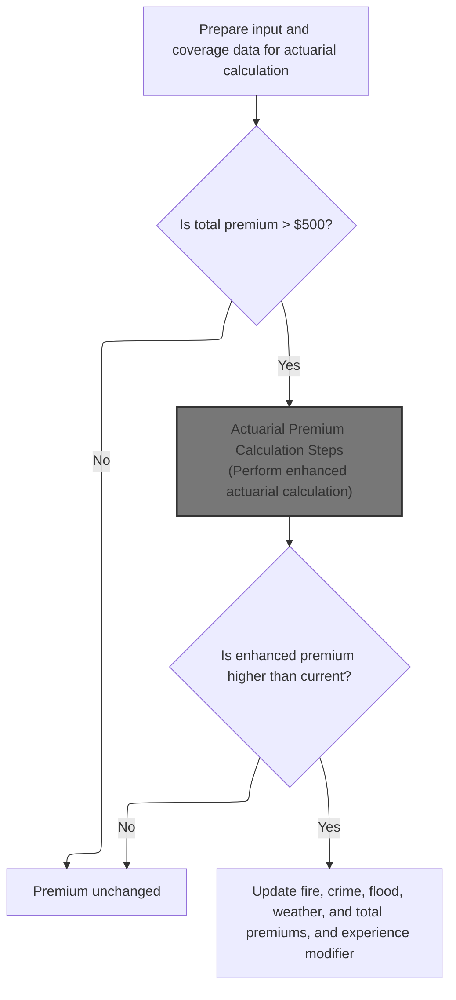

This section ensures that all required data is structured and available for actuarial premium calculation. It applies business rules to determine when enhanced actuarial calculations should be performed and when premium values should be updated.

| Category        | Rule Name                      | Description                                                                                                                                                                                                          |
| --------------- | ------------------------------ | -------------------------------------------------------------------------------------------------------------------------------------------------------------------------------------------------------------------- |
| Data validation | Complete data preparation      | All customer, property, and coverage data must be included in the actuarial input structure before any actuarial calculation is performed.                                                                           |
| Business logic  | Enhanced calculation threshold | If the total premium is greater than $500, an enhanced actuarial calculation is performed to determine if a higher premium is warranted.                                                                             |
| Business logic  | Premium update on increase     | If the enhanced actuarial calculation results in a total premium higher than the current premium, all premium fields (fire, crime, flood, weather, total) and the experience modifier are updated to the new values. |
| Business logic  | No change on lower premium     | If the enhanced actuarial calculation does not result in a higher total premium, the existing premium values remain unchanged.                                                                                       |
| Business logic  | Minimum premium constant       | The minimum premium threshold for enhanced actuarial calculation is $500, as defined by configuration.                                                                                                               |

<SwmSnippet path="/base/src/LGAPDB01.cbl" line="283" repo-id="Z2l0aHViJTNBJTNBY2ljcy1nZW5hcHAtZGVtbyUzQSUzQXN3aW1taW8=">

---

In <SwmToken path="/base/src/LGAPDB01.cbl" pos="283:1:7" line-data="       P011C-ENHANCED-ACTUARIAL-CALC." repo-id="Z2l0aHViJTNBJTNBY2ljcy1nZW5hcHAtZGVtbyUzQSUzQXN3aW1taW8=" repo-name="cics-genapp-demp">`P011C-ENHANCED-ACTUARIAL-CALC`</SwmToken>, we prep the input structure by moving all customer, property, and coverage fields into the actuarial data area. This sets up everything needed for the next calculation step.

```cobol
       P011C-ENHANCED-ACTUARIAL-CALC.
      *    Prepare input structure for actuarial calculation
           MOVE IN-CUSTOMER-NUM TO LK-CUSTOMER-NUM
           MOVE WS-BASE-RISK-SCR TO LK-RISK-SCORE
           MOVE IN-PROPERTY-TYPE TO LK-PROPERTY-TYPE
           MOVE IN-TERRITORY-CODE TO LK-TERRITORY
           MOVE IN-CONSTRUCTION-TYPE TO LK-CONSTRUCTION-TYPE
           MOVE IN-OCCUPANCY-CODE TO LK-OCCUPANCY-CODE
           MOVE IN-SPRINKLER-IND TO LK-PROTECTION-CLASS
           MOVE IN-YEAR-BUILT TO LK-YEAR-BUILT
           MOVE IN-SQUARE-FOOTAGE TO LK-SQUARE-FOOTAGE
           MOVE IN-YEARS-IN-BUSINESS TO LK-YEARS-IN-BUSINESS
           MOVE IN-CLAIMS-COUNT-3YR TO LK-CLAIMS-COUNT-5YR
           MOVE IN-CLAIMS-AMOUNT-3YR TO LK-CLAIMS-AMOUNT-5YR
           
      *    Set coverage data
           MOVE IN-BUILDING-LIMIT TO LK-BUILDING-LIMIT
           MOVE IN-CONTENTS-LIMIT TO LK-CONTENTS-LIMIT
           MOVE IN-BI-LIMIT TO LK-BI-LIMIT
           MOVE IN-FIRE-DEDUCTIBLE TO LK-FIRE-DEDUCTIBLE
           MOVE IN-WIND-DEDUCTIBLE TO LK-WIND-DEDUCTIBLE
           MOVE IN-FLOOD-DEDUCTIBLE TO LK-FLOOD-DEDUCTIBLE
           MOVE IN-OTHER-DEDUCTIBLE TO LK-OTHER-DEDUCTIBLE
           MOVE IN-FIRE-PERIL TO LK-FIRE-PERIL
           MOVE IN-CRIME-PERIL TO LK-CRIME-PERIL
           MOVE IN-FLOOD-PERIL TO LK-FLOOD-PERIL
           MOVE IN-WEATHER-PERIL TO LK-WEATHER-PERIL
```

---

</SwmSnippet>

<SwmSnippet path="/base/src/LGAPDB01.cbl" line="312" repo-id="Z2l0aHViJTNBJTNBY2ljcy1nZW5hcHAtZGVtbyUzQSUzQXN3aW1taW8=">

---

After prepping the input, we call <SwmToken path="/base/src/LGAPDB01.cbl" pos="313:4:4" line-data="               CALL &#39;LGAPDB04&#39; USING LK-INPUT-DATA, LK-COVERAGE-DATA, " repo-id="Z2l0aHViJTNBJTNBY2ljcy1nZW5hcHAtZGVtbyUzQSUzQXN3aW1taW8=" repo-name="cics-genapp-demp">`LGAPDB04`</SwmToken> for enhanced actuarial calculation. If the returned premium is higher, we update all premium fields with the new values.

```cobol
           IF WS-TOT-PREM > WS-MIN-PREMIUM
               CALL 'LGAPDB04' USING LK-INPUT-DATA, LK-COVERAGE-DATA, 
                                    LK-OUTPUT-RESULTS
               
      *        Update with enhanced calculations if successful
               IF LK-TOTAL-PREMIUM > WS-TOT-PREM
                   MOVE LK-FIRE-PREMIUM TO WS-FR-PREM
                   MOVE LK-CRIME-PREMIUM TO WS-CR-PREM
                   MOVE LK-FLOOD-PREMIUM TO WS-FL-PREM
                   MOVE LK-WEATHER-PREMIUM TO WS-WE-PREM
                   MOVE LK-TOTAL-PREMIUM TO WS-TOT-PREM
                   MOVE LK-EXPERIENCE-MOD TO WS-EXPERIENCE-MOD
               END-IF
           END-IF.
```

---

</SwmSnippet>

### Actuarial Premium Calculation Steps

```mermaid
%%{init: {"flowchart": {"defaultRenderer": "elk"}} }%%
flowchart TD
    node1["Start: Initialize policy and retrieve rates"]
    click node1 openCode "base/src/LGAPDB04.cbl:139:141"
    node2{"Is business 5+ years in operation?"}
    click node2 openCode "base/src/LGAPDB04.cbl:237:257"
    node2 -->|"Yes"| node3{"Claims in last 5 years?"}
    node2 -->|"No"| node5["Apply new business penalty to experience mod"]
    click node5 openCode "base/src/LGAPDB04.cbl:255:256"
    node3 -->|"No"| node4["Apply best experience modification (0.85)"]
    click node4 openCode "base/src/LGAPDB04.cbl:239:240"
    node3 -->|"Yes"| node6["Calculate experience mod based on claims (capped 0.5-2.0)"]
    click node6 openCode "base/src/LGAPDB04.cbl:241:252"
    node4 --> node7["Calculate schedule modification (building, protection, occupancy, exposure)"]
    click node7 openCode "base/src/LGAPDB04.cbl:260:316"
    node6 --> node7
    node5 --> node7
    node7 --> node8["Calculate base premium for each covered peril"]
    click node8 openCode "base/src/LGAPDB04.cbl:318:367"
    node8 --> node9["Apply catastrophe and expense loads"]
    click node9 openCode "base/src/LGAPDB04.cbl:145:147"
    node9 --> node10["Calculate discounts and deductible credits (multi-peril, claims-free, deductible; cap 25%)"]
    click node10 openCode "base/src/LGAPDB04.cbl:407:454"
    node10 --> node11["Calculate taxes (6.75%)"]
    click node11 openCode "base/src/LGAPDB04.cbl:456:462"
    node11 --> node12["Calculate final premium and rate factor"]
    click node12 openCode "base/src/LGAPDB04.cbl:464:472"
    node12 --> node13{"Is final rate factor > 0.050000?"}
    click node13 openCode "base/src/LGAPDB04.cbl:473:477"
    node13 -->|"Yes"| node14["Cap rate factor and recalculate premium"]
    click node14 openCode "base/src/LGAPDB04.cbl:474:477"
    node13 -->|"No"| node15["End: Output final premium"]
    click node15 openCode "base/src/LGAPDB04.cbl:150:150"
    node14 --> node15
classDef HeadingStyle fill:#777777,stroke:#333,stroke-width:2px;

%% Swimm:
%% %%{init: {"flowchart": {"defaultRenderer": "elk"}} }%%
%% flowchart TD
%%     node1["Start: Initialize policy and retrieve rates"]
%%     click node1 openCode "<SwmPath repo-id="Z2l0aHViJTNBJTNBY2ljcy1nZW5hcHAtZGVtbyUzQSUzQXN3aW1taW8=" repo-name="cics-genapp-demp" path="/base/src/LGAPDB04.cbl">`(cics-genapp-demp) base/src/LGAPDB04.cbl`</SwmPath>:139:141"
%%     node2{"Is business 5+ years in operation?"}
%%     click node2 openCode "<SwmPath repo-id="Z2l0aHViJTNBJTNBY2ljcy1nZW5hcHAtZGVtbyUzQSUzQXN3aW1taW8=" repo-name="cics-genapp-demp" path="/base/src/LGAPDB04.cbl">`(cics-genapp-demp) base/src/LGAPDB04.cbl`</SwmPath>:237:257"
%%     node2 -->|"Yes"| node3{"Claims in last 5 years?"}
%%     node2 -->|"No"| node5["Apply new business penalty to experience mod"]
%%     click node5 openCode "<SwmPath repo-id="Z2l0aHViJTNBJTNBY2ljcy1nZW5hcHAtZGVtbyUzQSUzQXN3aW1taW8=" repo-name="cics-genapp-demp" path="/base/src/LGAPDB04.cbl">`(cics-genapp-demp) base/src/LGAPDB04.cbl`</SwmPath>:255:256"
%%     node3 -->|"No"| node4["Apply best experience modification (0.85)"]
%%     click node4 openCode "<SwmPath repo-id="Z2l0aHViJTNBJTNBY2ljcy1nZW5hcHAtZGVtbyUzQSUzQXN3aW1taW8=" repo-name="cics-genapp-demp" path="/base/src/LGAPDB04.cbl">`(cics-genapp-demp) base/src/LGAPDB04.cbl`</SwmPath>:239:240"
%%     node3 -->|"Yes"| node6["Calculate experience mod based on claims (capped 0.5-2.0)"]
%%     click node6 openCode "<SwmPath repo-id="Z2l0aHViJTNBJTNBY2ljcy1nZW5hcHAtZGVtbyUzQSUzQXN3aW1taW8=" repo-name="cics-genapp-demp" path="/base/src/LGAPDB04.cbl">`(cics-genapp-demp) base/src/LGAPDB04.cbl`</SwmPath>:241:252"
%%     node4 --> node7["Calculate schedule modification (building, protection, occupancy, exposure)"]
%%     click node7 openCode "<SwmPath repo-id="Z2l0aHViJTNBJTNBY2ljcy1nZW5hcHAtZGVtbyUzQSUzQXN3aW1taW8=" repo-name="cics-genapp-demp" path="/base/src/LGAPDB04.cbl">`(cics-genapp-demp) base/src/LGAPDB04.cbl`</SwmPath>:260:316"
%%     node6 --> node7
%%     node5 --> node7
%%     node7 --> node8["Calculate base premium for each covered peril"]
%%     click node8 openCode "<SwmPath repo-id="Z2l0aHViJTNBJTNBY2ljcy1nZW5hcHAtZGVtbyUzQSUzQXN3aW1taW8=" repo-name="cics-genapp-demp" path="/base/src/LGAPDB04.cbl">`(cics-genapp-demp) base/src/LGAPDB04.cbl`</SwmPath>:318:367"
%%     node8 --> node9["Apply catastrophe and expense loads"]
%%     click node9 openCode "<SwmPath repo-id="Z2l0aHViJTNBJTNBY2ljcy1nZW5hcHAtZGVtbyUzQSUzQXN3aW1taW8=" repo-name="cics-genapp-demp" path="/base/src/LGAPDB04.cbl">`(cics-genapp-demp) base/src/LGAPDB04.cbl`</SwmPath>:145:147"
%%     node9 --> node10["Calculate discounts and deductible credits (multi-peril, claims-free, deductible; cap 25%)"]
%%     click node10 openCode "<SwmPath repo-id="Z2l0aHViJTNBJTNBY2ljcy1nZW5hcHAtZGVtbyUzQSUzQXN3aW1taW8=" repo-name="cics-genapp-demp" path="/base/src/LGAPDB04.cbl">`(cics-genapp-demp) base/src/LGAPDB04.cbl`</SwmPath>:407:454"
%%     node10 --> node11["Calculate taxes (6.75%)"]
%%     click node11 openCode "<SwmPath repo-id="Z2l0aHViJTNBJTNBY2ljcy1nZW5hcHAtZGVtbyUzQSUzQXN3aW1taW8=" repo-name="cics-genapp-demp" path="/base/src/LGAPDB04.cbl">`(cics-genapp-demp) base/src/LGAPDB04.cbl`</SwmPath>:456:462"
%%     node11 --> node12["Calculate final premium and rate factor"]
%%     click node12 openCode "<SwmPath repo-id="Z2l0aHViJTNBJTNBY2ljcy1nZW5hcHAtZGVtbyUzQSUzQXN3aW1taW8=" repo-name="cics-genapp-demp" path="/base/src/LGAPDB04.cbl">`(cics-genapp-demp) base/src/LGAPDB04.cbl`</SwmPath>:464:472"
%%     node12 --> node13{"Is final rate factor > <SwmToken path="/base/src/LGAPDB04.cbl" pos="473:13:15" line-data="           IF LK-FINAL-RATE-FACTOR &gt; 0.050000" repo-id="Z2l0aHViJTNBJTNBY2ljcy1nZW5hcHAtZGVtbyUzQSUzQXN3aW1taW8=" repo-name="cics-genapp-demp">`0.050000`</SwmToken>?"}
%%     click node13 openCode "<SwmPath repo-id="Z2l0aHViJTNBJTNBY2ljcy1nZW5hcHAtZGVtbyUzQSUzQXN3aW1taW8=" repo-name="cics-genapp-demp" path="/base/src/LGAPDB04.cbl">`(cics-genapp-demp) base/src/LGAPDB04.cbl`</SwmPath>:473:477"
%%     node13 -->|"Yes"| node14["Cap rate factor and recalculate premium"]
%%     click node14 openCode "<SwmPath repo-id="Z2l0aHViJTNBJTNBY2ljcy1nZW5hcHAtZGVtbyUzQSUzQXN3aW1taW8=" repo-name="cics-genapp-demp" path="/base/src/LGAPDB04.cbl">`(cics-genapp-demp) base/src/LGAPDB04.cbl`</SwmPath>:474:477"
%%     node13 -->|"No"| node15["End: Output final premium"]
%%     click node15 openCode "<SwmPath repo-id="Z2l0aHViJTNBJTNBY2ljcy1nZW5hcHAtZGVtbyUzQSUzQXN3aW1taW8=" repo-name="cics-genapp-demp" path="/base/src/LGAPDB04.cbl">`(cics-genapp-demp) base/src/LGAPDB04.cbl`</SwmPath>:150:150"
%%     node14 --> node15
%% classDef HeadingStyle fill:#777777,stroke:#333,stroke-width:2px;
```

This section governs the actuarial premium calculation for commercial property insurance policies. It determines the final premium by applying experience and schedule modifiers, aggregating peril premiums, applying discounts and taxes, and enforcing caps on rate factors.

| Category        | Rule Name                                                                                                                                                                                                                          | Description                                                                                                                                                                                                                                                                                                                                                                                                                                                                                                                                                                                                                                                       |
| --------------- | ---------------------------------------------------------------------------------------------------------------------------------------------------------------------------------------------------------------------------------- | ----------------------------------------------------------------------------------------------------------------------------------------------------------------------------------------------------------------------------------------------------------------------------------------------------------------------------------------------------------------------------------------------------------------------------------------------------------------------------------------------------------------------------------------------------------------------------------------------------------------------------------------------------------------- |
| Data validation | Discount cap                                                                                                                                                                                                                       | Total discounts and credits cannot exceed 25% of the sum of all premium components before taxes.                                                                                                                                                                                                                                                                                                                                                                                                                                                                                                                                                                  |
| Data validation | Rate factor cap                                                                                                                                                                                                                    | The final rate factor, calculated as the ratio of total premium to insured value, cannot exceed <SwmToken path="/base/src/LGAPDB04.cbl" pos="473:13:15" line-data="           IF LK-FINAL-RATE-FACTOR &gt; 0.050000" repo-id="Z2l0aHViJTNBJTNBY2ljcy1nZW5hcHAtZGVtbyUzQSUzQXN3aW1taW8=" repo-name="cics-genapp-demp">`0.050000`</SwmToken>. If it does, the rate factor is capped and the premium is recalculated accordingly.                                                                                                                                                                                                                                    |
| Business logic  | New business penalty                                                                                                                                                                                                               | If the business has operated for less than 5 years, a new business penalty is applied to the experience modifier, increasing it to 1.10.                                                                                                                                                                                                                                                                                                                                                                                                                                                                                                                          |
| Business logic  | Best experience discount                                                                                                                                                                                                           | If the business has operated for 5 or more years and has no claims in the last 5 years, the experience modifier is set to 0.85, reflecting best experience.                                                                                                                                                                                                                                                                                                                                                                                                                                                                                                       |
| Business logic  | Claims-based experience modifier                                                                                                                                                                                                   | If the business has operated for 5 or more years and has claims in the last 5 years, the experience modifier is calculated based on claims amount, insured value, and credibility factor, but is capped between 0.5 and 2.0.                                                                                                                                                                                                                                                                                                                                                                                                                                      |
| Business logic  | Schedule modifier limits                                                                                                                                                                                                           | The schedule modifier is determined by building age, protection class, occupancy code, and exposure density, with each factor adjusting the modifier by fixed amounts. The final schedule modifier is clamped between -0.20 and +0.40.                                                                                                                                                                                                                                                                                                                                                                                                                            |
| Business logic  | Peril premium calculation                                                                                                                                                                                                          | Base premium for each peril (fire, crime, flood, weather) is calculated only if the peril indicator is set. Crime and flood premiums receive additional multipliers of <SwmToken path="/base/src/LGAPDB04.cbl" pos="336:10:12" line-data="                   (WS-CONTENTS-EXPOSURE * 0.80) *" repo-id="Z2l0aHViJTNBJTNBY2ljcy1nZW5hcHAtZGVtbyUzQSUzQXN3aW1taW8=" repo-name="cics-genapp-demp">`0.80`</SwmToken> and <SwmToken path="/base/src/LGAPDB04.cbl" pos="352:9:11" line-data="                   WS-TREND-FACTOR * 1.25" repo-id="Z2l0aHViJTNBJTNBY2ljcy1nZW5hcHAtZGVtbyUzQSUzQXN3aW1taW8=" repo-name="cics-genapp-demp">`1.25`</SwmToken>, respectively. |
| Business logic  | <SwmToken path="/base/src/LGAPDB04.cbl" pos="410:3:5" line-data="      * Multi-peril discount" repo-id="Z2l0aHViJTNBJTNBY2ljcy1nZW5hcHAtZGVtbyUzQSUzQXN3aW1taW8=" repo-name="cics-genapp-demp">`Multi-peril`</SwmToken> discount   | <SwmToken path="/base/src/LGAPDB04.cbl" pos="410:3:5" line-data="      * Multi-peril discount" repo-id="Z2l0aHViJTNBJTNBY2ljcy1nZW5hcHAtZGVtbyUzQSUzQXN3aW1taW8=" repo-name="cics-genapp-demp">`Multi-peril`</SwmToken> coverage qualifies for a discount of 10%. Partial multi-peril coverage qualifies for a 5% discount.                                                                                                                                                                                                                                                                                                                                       |
| Business logic  | <SwmToken path="/base/src/LGAPDB04.cbl" pos="425:3:5" line-data="      * Claims-free discount  " repo-id="Z2l0aHViJTNBJTNBY2ljcy1nZW5hcHAtZGVtbyUzQSUzQXN3aW1taW8=" repo-name="cics-genapp-demp">`Claims-free`</SwmToken> discount | If the business has been claims-free for 5 years and has operated for at least 5 years, a claims-free discount of 7.5% is applied.                                                                                                                                                                                                                                                                                                                                                                                                                                                                                                                                |
| Business logic  | Deductible credits                                                                                                                                                                                                                 | Deductible credits are applied as follows: $10,000+ fire deductible earns 2.5%, $25,000+ wind deductible earns 3.5%, $50,000+ flood deductible earns 4.5%.                                                                                                                                                                                                                                                                                                                                                                                                                                                                                                        |
| Business logic  | Tax rate                                                                                                                                                                                                                           | Taxes are calculated at a fixed rate of 6.75% on the net premium after discounts are applied.                                                                                                                                                                                                                                                                                                                                                                                                                                                                                                                                                                     |

<SwmSnippet path="/base/src/LGAPDB04.cbl" line="138" repo-id="Z2l0aHViJTNBJTNBY2ljcy1nZW5hcHAtZGVtbyUzQSUzQXN3aW1taW8=">

---

<SwmToken path="/base/src/LGAPDB04.cbl" pos="138:1:3" line-data="       P100-MAIN." repo-id="Z2l0aHViJTNBJTNBY2ljcy1nZW5hcHAtZGVtbyUzQSUzQXN3aW1taW8=" repo-name="cics-genapp-demp">`P100-MAIN`</SwmToken> runs all the actuarial premium calculation steps in order. We call <SwmToken path="/base/src/LGAPDB04.cbl" pos="234:1:5" line-data="       P400-EXP-MOD." repo-id="Z2l0aHViJTNBJTNBY2ljcy1nZW5hcHAtZGVtbyUzQSUzQXN3aW1taW8=" repo-name="cics-genapp-demp">`P400-EXP-MOD`</SwmToken> early to set the experience modifier, which affects all downstream premium calculations.

```cobol
       P100-MAIN.
           PERFORM P200-INIT
           PERFORM P300-RATES
           PERFORM P350-EXPOSURE
           PERFORM P400-EXP-MOD
           PERFORM P500-SCHED-MOD
           PERFORM P600-BASE-PREM
           PERFORM P700-CAT-LOAD
           PERFORM P800-EXPENSE
           PERFORM P900-DISC
           PERFORM P950-TAXES
           PERFORM P999-FINAL
           GOBACK.
```

---

</SwmSnippet>

<SwmSnippet path="/base/src/LGAPDB04.cbl" line="234" repo-id="Z2l0aHViJTNBJTNBY2ljcy1nZW5hcHAtZGVtbyUzQSUzQXN3aW1taW8=">

---

<SwmToken path="/base/src/LGAPDB04.cbl" pos="234:1:5" line-data="       P400-EXP-MOD." repo-id="Z2l0aHViJTNBJTNBY2ljcy1nZW5hcHAtZGVtbyUzQSUzQXN3aW1taW8=" repo-name="cics-genapp-demp">`P400-EXP-MOD`</SwmToken> sets the experience modifier based on years in business and claims history. It uses fixed constants for discounts, caps, and floors, and calculates the modifier using claims amount, insured value, and credibility factor.

```cobol
       P400-EXP-MOD.
           MOVE 1.0000 TO WS-EXPERIENCE-MOD
           
           IF LK-YEARS-IN-BUSINESS >= 5
               IF LK-CLAIMS-COUNT-5YR = ZERO
                   MOVE 0.8500 TO WS-EXPERIENCE-MOD
               ELSE
                   COMPUTE WS-EXPERIENCE-MOD = 
                       1.0000 + 
                       ((LK-CLAIMS-AMOUNT-5YR / WS-TOTAL-INSURED-VAL) * 
                        WS-CREDIBILITY-FACTOR * 0.50)
                   
                   IF WS-EXPERIENCE-MOD > 2.0000
                       MOVE 2.0000 TO WS-EXPERIENCE-MOD
                   END-IF
                   
                   IF WS-EXPERIENCE-MOD < 0.5000
                       MOVE 0.5000 TO WS-EXPERIENCE-MOD
                   END-IF
               END-IF
           ELSE
               MOVE 1.1000 TO WS-EXPERIENCE-MOD
           END-IF
           
           MOVE WS-EXPERIENCE-MOD TO LK-EXPERIENCE-MOD.
```

---

</SwmSnippet>

<SwmSnippet path="/base/src/LGAPDB04.cbl" line="260" repo-id="Z2l0aHViJTNBJTNBY2ljcy1nZW5hcHAtZGVtbyUzQSUzQXN3aW1taW8=">

---

<SwmToken path="/base/src/LGAPDB04.cbl" pos="260:1:5" line-data="       P500-SCHED-MOD." repo-id="Z2l0aHViJTNBJTNBY2ljcy1nZW5hcHAtZGVtbyUzQSUzQXN3aW1taW8=" repo-name="cics-genapp-demp">`P500-SCHED-MOD`</SwmToken> calculates the schedule modifier by adjusting for building age, protection class, occupancy code, and exposure density. Each factor tweaks the modifier using fixed values, and the result is clamped to a set range before being used.

```cobol
       P500-SCHED-MOD.
           MOVE +0.000 TO WS-SCHEDULE-MOD
           
      *    Building age factor
           EVALUATE TRUE
               WHEN LK-YEAR-BUILT >= 2010
                   SUBTRACT 0.050 FROM WS-SCHEDULE-MOD
               WHEN LK-YEAR-BUILT >= 1990
                   CONTINUE
               WHEN LK-YEAR-BUILT >= 1970
                   ADD 0.100 TO WS-SCHEDULE-MOD
               WHEN OTHER
                   ADD 0.200 TO WS-SCHEDULE-MOD
           END-EVALUATE
           
      *    Protection class factor
           EVALUATE LK-PROTECTION-CLASS
               WHEN '01' THRU '03'
                   SUBTRACT 0.100 FROM WS-SCHEDULE-MOD
               WHEN '04' THRU '06'
                   SUBTRACT 0.050 FROM WS-SCHEDULE-MOD
               WHEN '07' THRU '09'
                   CONTINUE
               WHEN OTHER
                   ADD 0.150 TO WS-SCHEDULE-MOD
           END-EVALUATE
           
      *    Occupancy hazard factor
           EVALUATE LK-OCCUPANCY-CODE
               WHEN 'OFF01' THRU 'OFF05'
                   SUBTRACT 0.025 FROM WS-SCHEDULE-MOD
               WHEN 'MFG01' THRU 'MFG10'
                   ADD 0.075 TO WS-SCHEDULE-MOD
               WHEN 'WHS01' THRU 'WHS05'
                   ADD 0.125 TO WS-SCHEDULE-MOD
               WHEN OTHER
                   CONTINUE
           END-EVALUATE
           
      *    Exposure density factor
           IF WS-EXPOSURE-DENSITY > 500.00
               ADD 0.100 TO WS-SCHEDULE-MOD
           ELSE
               IF WS-EXPOSURE-DENSITY < 50.00
                   SUBTRACT 0.050 FROM WS-SCHEDULE-MOD
               END-IF
           END-IF
           
           IF WS-SCHEDULE-MOD > +0.400
               MOVE +0.400 TO WS-SCHEDULE-MOD
           END-IF
           
           IF WS-SCHEDULE-MOD < -0.200
               MOVE -0.200 TO WS-SCHEDULE-MOD
           END-IF
           
           MOVE WS-SCHEDULE-MOD TO LK-SCHEDULE-MOD.
```

---

</SwmSnippet>

<SwmSnippet path="/base/src/LGAPDB04.cbl" line="318" repo-id="Z2l0aHViJTNBJTNBY2ljcy1nZW5hcHAtZGVtbyUzQSUzQXN3aW1taW8=">

---

<SwmToken path="/base/src/LGAPDB04.cbl" pos="318:1:5" line-data="       P600-BASE-PREM." repo-id="Z2l0aHViJTNBJTNBY2ljcy1nZW5hcHAtZGVtbyUzQSUzQXN3aW1taW8=" repo-name="cics-genapp-demp">`P600-BASE-PREM`</SwmToken> aggregates the base premium for each peril (fire, crime, flood, weather) if the peril indicator is set. For each peril, it multiplies exposures by a base rate (looked up using <SwmToken path="/base/src/LGAPDB04.cbl" pos="325:1:5" line-data="                   WS-BASE-RATE (1, 1, 1, 1) * " repo-id="Z2l0aHViJTNBJTNBY2ljcy1nZW5hcHAtZGVtbyUzQSUzQXN3aW1taW8=" repo-name="cics-genapp-demp">`WS-BASE-RATE`</SwmToken> with peril/territory/construction/occupancy indices), applies experience and schedule modifiers, and trend factors. Crime and flood get extra multipliers (<SwmToken path="/base/src/LGAPDB04.cbl" pos="336:10:12" line-data="                   (WS-CONTENTS-EXPOSURE * 0.80) *" repo-id="Z2l0aHViJTNBJTNBY2ljcy1nZW5hcHAtZGVtbyUzQSUzQXN3aW1taW8=" repo-name="cics-genapp-demp">`0.80`</SwmToken> and <SwmToken path="/base/src/LGAPDB04.cbl" pos="352:9:11" line-data="                   WS-TREND-FACTOR * 1.25" repo-id="Z2l0aHViJTNBJTNBY2ljcy1nZW5hcHAtZGVtbyUzQSUzQXN3aW1taW8=" repo-name="cics-genapp-demp">`1.25`</SwmToken>). Each calculated peril premium is added to <SwmToken path="/base/src/LGAPDB04.cbl" pos="319:7:11" line-data="           MOVE ZERO TO LK-BASE-AMOUNT" repo-id="Z2l0aHViJTNBJTNBY2ljcy1nZW5hcHAtZGVtbyUzQSUzQXN3aW1taW8=" repo-name="cics-genapp-demp">`LK-BASE-AMOUNT`</SwmToken>, so the total reflects all applicable risks. The function assumes all input exposures and modifiers are set up before this runs.

```cobol
       P600-BASE-PREM.
           MOVE ZERO TO LK-BASE-AMOUNT
           
      * FIRE PREMIUM
           IF LK-FIRE-PERIL > ZERO
               COMPUTE LK-FIRE-PREMIUM = 
                   (WS-BUILDING-EXPOSURE + WS-CONTENTS-EXPOSURE) *
                   WS-BASE-RATE (1, 1, 1, 1) * 
                   WS-EXPERIENCE-MOD *
                   (1 + WS-SCHEDULE-MOD) *
                   WS-TREND-FACTOR
                   
               ADD LK-FIRE-PREMIUM TO LK-BASE-AMOUNT
           END-IF
           
      * CRIME PREMIUM
           IF LK-CRIME-PERIL > ZERO
               COMPUTE LK-CRIME-PREMIUM = 
                   (WS-CONTENTS-EXPOSURE * 0.80) *
                   WS-BASE-RATE (2, 1, 1, 1) * 
                   WS-EXPERIENCE-MOD *
                   (1 + WS-SCHEDULE-MOD) *
                   WS-TREND-FACTOR
                   
               ADD LK-CRIME-PREMIUM TO LK-BASE-AMOUNT
           END-IF
           
      * FLOOD PREMIUM
           IF LK-FLOOD-PERIL > ZERO
               COMPUTE LK-FLOOD-PREMIUM = 
                   WS-BUILDING-EXPOSURE *
                   WS-BASE-RATE (3, 1, 1, 1) * 
                   WS-EXPERIENCE-MOD *
                   (1 + WS-SCHEDULE-MOD) *
                   WS-TREND-FACTOR * 1.25
                   
               ADD LK-FLOOD-PREMIUM TO LK-BASE-AMOUNT
           END-IF
           
      * WEATHER PREMIUM
           IF LK-WEATHER-PERIL > ZERO
               COMPUTE LK-WEATHER-PREMIUM = 
                   (WS-BUILDING-EXPOSURE + WS-CONTENTS-EXPOSURE) *
                   WS-BASE-RATE (4, 1, 1, 1) * 
                   WS-EXPERIENCE-MOD *
                   (1 + WS-SCHEDULE-MOD) *
                   WS-TREND-FACTOR
                   
               ADD LK-WEATHER-PREMIUM TO LK-BASE-AMOUNT
           END-IF.
```

---

</SwmSnippet>

<SwmSnippet path="/base/src/LGAPDB04.cbl" line="407" repo-id="Z2l0aHViJTNBJTNBY2ljcy1nZW5hcHAtZGVtbyUzQSUzQXN3aW1taW8=">

---

<SwmToken path="/base/src/LGAPDB04.cbl" pos="407:1:3" line-data="       P900-DISC." repo-id="Z2l0aHViJTNBJTNBY2ljcy1nZW5hcHAtZGVtbyUzQSUzQXN3aW1taW8=" repo-name="cics-genapp-demp">`P900-DISC`</SwmToken> figures out the total discount by checking for multi-peril coverage, claims-free history, and high deductibles. Each condition adds a discount or credit, but the total can't go over 25%. The final discount is applied to the sum of all premium components (base, catastrophe, expense, profit), so the discount reflects the full premium before taxes.

```cobol
       P900-DISC.
           MOVE ZERO TO WS-TOTAL-DISCOUNT
           
      * Multi-peril discount
           MOVE ZERO TO WS-MULTI-PERIL-DISC
           IF LK-FIRE-PERIL > ZERO AND
              LK-CRIME-PERIL > ZERO AND
              LK-FLOOD-PERIL > ZERO AND
              LK-WEATHER-PERIL > ZERO
               MOVE 0.100 TO WS-MULTI-PERIL-DISC
           ELSE
               IF LK-FIRE-PERIL > ZERO AND
                  LK-WEATHER-PERIL > ZERO AND
                  (LK-CRIME-PERIL > ZERO OR LK-FLOOD-PERIL > ZERO)
                   MOVE 0.050 TO WS-MULTI-PERIL-DISC
               END-IF
           END-IF
           
      * Claims-free discount  
           MOVE ZERO TO WS-CLAIMS-FREE-DISC
           IF LK-CLAIMS-COUNT-5YR = ZERO AND LK-YEARS-IN-BUSINESS >= 5
               MOVE 0.075 TO WS-CLAIMS-FREE-DISC
           END-IF
           
      * Deductible credit
           MOVE ZERO TO WS-DEDUCTIBLE-CREDIT
           IF LK-FIRE-DEDUCTIBLE >= 10000
               ADD 0.025 TO WS-DEDUCTIBLE-CREDIT
           END-IF
           IF LK-WIND-DEDUCTIBLE >= 25000  
               ADD 0.035 TO WS-DEDUCTIBLE-CREDIT
           END-IF
           IF LK-FLOOD-DEDUCTIBLE >= 50000
               ADD 0.045 TO WS-DEDUCTIBLE-CREDIT
           END-IF
           
           COMPUTE WS-TOTAL-DISCOUNT = 
               WS-MULTI-PERIL-DISC + WS-CLAIMS-FREE-DISC + 
               WS-DEDUCTIBLE-CREDIT
               
           IF WS-TOTAL-DISCOUNT > 0.250
               MOVE 0.250 TO WS-TOTAL-DISCOUNT
           END-IF
           
           COMPUTE LK-DISCOUNT-AMT = 
               (LK-BASE-AMOUNT + LK-CAT-LOAD-AMT + 
                LK-EXPENSE-LOAD-AMT + LK-PROFIT-LOAD-AMT) *
               WS-TOTAL-DISCOUNT.
```

---

</SwmSnippet>

<SwmSnippet path="/base/src/LGAPDB04.cbl" line="456" repo-id="Z2l0aHViJTNBJTNBY2ljcy1nZW5hcHAtZGVtbyUzQSUzQXN3aW1taW8=">

---

<SwmToken path="/base/src/LGAPDB04.cbl" pos="456:1:3" line-data="       P950-TAXES." repo-id="Z2l0aHViJTNBJTNBY2ljcy1nZW5hcHAtZGVtbyUzQSUzQXN3aW1taW8=" repo-name="cics-genapp-demp">`P950-TAXES`</SwmToken> computes the tax by applying a fixed 6.75% rate to the sum of all premium components minus the discount. The tax is only charged on the net premium after discounts, not the gross amount.

```cobol
       P950-TAXES.
           COMPUTE WS-TAX-AMOUNT = 
               (LK-BASE-AMOUNT + LK-CAT-LOAD-AMT + 
                LK-EXPENSE-LOAD-AMT + LK-PROFIT-LOAD-AMT - 
                LK-DISCOUNT-AMT) * 0.0675
                
           MOVE WS-TAX-AMOUNT TO LK-TAX-AMT.
```

---

</SwmSnippet>

<SwmSnippet path="/base/src/LGAPDB04.cbl" line="464" repo-id="Z2l0aHViJTNBJTNBY2ljcy1nZW5hcHAtZGVtbyUzQSUzQXN3aW1taW8=">

---

<SwmToken path="/base/src/LGAPDB04.cbl" pos="464:1:3" line-data="       P999-FINAL." repo-id="Z2l0aHViJTNBJTNBY2ljcy1nZW5hcHAtZGVtbyUzQSUzQXN3aW1taW8=" repo-name="cics-genapp-demp">`P999-FINAL`</SwmToken> wraps up the premium calculation by summing all components, subtracting discounts, adding tax, and then calculating the final rate factor as a ratio of premium to insured value. If the rate factor is above 0.05, it's capped and the premium is recalculated to match the cap.

```cobol
       P999-FINAL.
           COMPUTE LK-TOTAL-PREMIUM = 
               LK-BASE-AMOUNT + LK-CAT-LOAD-AMT + 
               LK-EXPENSE-LOAD-AMT + LK-PROFIT-LOAD-AMT -
               LK-DISCOUNT-AMT + LK-TAX-AMT
               
           COMPUTE LK-FINAL-RATE-FACTOR = 
               LK-TOTAL-PREMIUM / WS-TOTAL-INSURED-VAL
               
           IF LK-FINAL-RATE-FACTOR > 0.050000
               MOVE 0.050000 TO LK-FINAL-RATE-FACTOR
               COMPUTE LK-TOTAL-PREMIUM = 
                   WS-TOTAL-INSURED-VAL * LK-FINAL-RATE-FACTOR
           END-IF.
```

---

</SwmSnippet>

### Business Rules, Output, and Stats Update

<SwmSnippet path="/base/src/LGAPDB01.cbl" line="264" repo-id="Z2l0aHViJTNBJTNBY2ljcy1nZW5hcHAtZGVtbyUzQSUzQXN3aW1taW8=">

---

After returning from <SwmToken path="/base/src/LGAPDB01.cbl" pos="262:3:9" line-data="               PERFORM P011C-ENHANCED-ACTUARIAL-CALC" repo-id="Z2l0aHViJTNBJTNBY2ljcy1nZW5hcHAtZGVtbyUzQSUzQXN3aW1taW8=" repo-name="cics-genapp-demp">`P011C-ENHANCED-ACTUARIAL-CALC`</SwmToken>, <SwmToken path="/base/src/LGAPDB01.cbl" pos="236:3:7" line-data="               PERFORM P011-PROCESS-COMMERCIAL" repo-id="Z2l0aHViJTNBJTNBY2ljcy1nZW5hcHAtZGVtbyUzQSUzQXN3aW1taW8=" repo-name="cics-genapp-demp">`P011-PROCESS-COMMERCIAL`</SwmToken> runs business rules, writes the output record, and then calls <SwmToken path="/base/src/LGAPDB01.cbl" pos="266:3:7" line-data="           PERFORM P011F-UPDATE-STATISTICS." repo-id="Z2l0aHViJTNBJTNBY2ljcy1nZW5hcHAtZGVtbyUzQSUzQXN3aW1taW8=" repo-name="cics-genapp-demp">`P011F-UPDATE-STATISTICS`</SwmToken>. This last step makes sure all cumulative stats (like totals and counts) reflect the final processed record, including any changes from the enhanced actuarial calculation.

```cobol
           PERFORM P011D-APPLY-BUSINESS-RULES
           PERFORM P011E-WRITE-OUTPUT-RECORD
           PERFORM P011F-UPDATE-STATISTICS.
```

---

</SwmSnippet>

## Cumulative Statistics and Risk Tracking

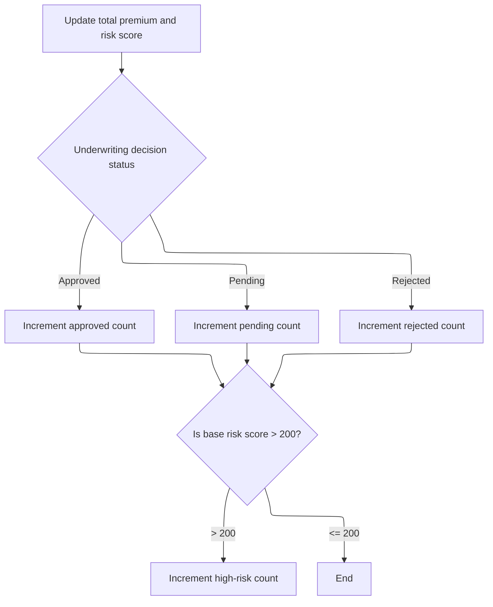

This section is responsible for maintaining up-to-date cumulative statistics and risk tracking for all processed insurance records. It ensures that summary metrics reflect the latest underwriting decisions and risk assessments.

| Category        | Rule Name                       | Description                                                                                                                              |
| --------------- | ------------------------------- | ---------------------------------------------------------------------------------------------------------------------------------------- |
| Data validation | Statistics initialization       | All counters and cumulative totals must be initialized to zero at the start of processing to ensure accurate statistics.                 |
| Business logic  | Cumulative premium tracking     | The total premium amount must be updated by adding the current record's premium to the running total for all processed records.          |
| Business logic  | Cumulative risk score tracking  | The total base risk score must be updated by adding the current record's base risk score to the running total for all processed records. |
| Business logic  | Decision status counting        | For each processed record, increment the counter corresponding to the underwriting decision status: approved, pending, or rejected.      |
| Business logic  | High-risk record identification | If a record's base risk score exceeds 200, increment the high-risk record counter to track the number of high-risk cases.                |

<SwmSnippet path="/base/src/LGAPDB01.cbl" line="365" repo-id="Z2l0aHViJTNBJTNBY2ljcy1nZW5hcHAtZGVtbyUzQSUzQXN3aW1taW8=">

---

In <SwmToken path="/base/src/LGAPDB01.cbl" pos="266:3:7" line-data="           PERFORM P011F-UPDATE-STATISTICS." repo-id="Z2l0aHViJTNBJTNBY2ljcy1nZW5hcHAtZGVtbyUzQSUzQXN3aW1taW8=" repo-name="cics-genapp-demp">`P011F-UPDATE-STATISTICS`</SwmToken>, we add the current premium and risk score to running totals, then use <SwmToken path="/base/src/LGAPDB01.cbl" pos="369:3:5" line-data="           EVALUATE WS-STAT" repo-id="Z2l0aHViJTNBJTNBY2ljcy1nZW5hcHAtZGVtbyUzQSUzQXN3aW1taW8=" repo-name="cics-genapp-demp">`WS-STAT`</SwmToken> to bump the right counter (approved, pending, rejected). This keeps all summary stats up to date for each processed record.

```cobol
       P011F-UPDATE-STATISTICS.
           ADD WS-TOT-PREM TO WS-TOTAL-PREMIUM-AMT
           ADD WS-BASE-RISK-SCR TO WS-CONTROL-TOTALS
           
           EVALUATE WS-STAT
               WHEN 0 ADD 1 TO WS-APPROVED-CNT
               WHEN 1 ADD 1 TO WS-PENDING-CNT
               WHEN 2 ADD 1 TO WS-REJECTED-CNT
           END-EVALUATE
```

---

</SwmSnippet>

<SwmSnippet path="/base/src/LGAPDB01.cbl" line="375" repo-id="Z2l0aHViJTNBJTNBY2ljcy1nZW5hcHAtZGVtbyUzQSUzQXN3aW1taW8=">

---

After updating totals and counters, <SwmToken path="/base/src/LGAPDB01.cbl" pos="266:3:7" line-data="           PERFORM P011F-UPDATE-STATISTICS." repo-id="Z2l0aHViJTNBJTNBY2ljcy1nZW5hcHAtZGVtbyUzQSUzQXN3aW1taW8=" repo-name="cics-genapp-demp">`P011F-UPDATE-STATISTICS`</SwmToken> checks if the risk score is over 200 and bumps the high risk count if so. This lets us track how many records are flagged as high risk for reporting.

```cobol
           IF WS-BASE-RISK-SCR > 200
               ADD 1 TO WS-HIGH-RISK-CNT
           END-IF.
```

---

</SwmSnippet>

## Looping for Next Input Record

<SwmSnippet path="/base/src/LGAPDB01.cbl" line="188" repo-id="Z2l0aHViJTNBJTNBY2ljcy1nZW5hcHAtZGVtbyUzQSUzQXN3aW1taW8=">

---

<SwmToken path="/base/src/LGAPDB01.cbl" pos="94:3:7" line-data="           PERFORM P006-PROCESS-RECORDS" repo-id="Z2l0aHViJTNBJTNBY2ljcy1nZW5hcHAtZGVtbyUzQSUzQXN3aW1taW8=" repo-name="cics-genapp-demp">`P006-PROCESS-RECORDS`</SwmToken> goes right to the next input after finishing with a valid record, keeping the loop moving.

```cobol
               PERFORM P007-READ-INPUT
           END-PERFORM.
```

---

</SwmSnippet>

&nbsp;

*This is an auto-generated document by Swimm 🌊 and has not yet been verified by a human*

<SwmMeta version="3.0.0"><sup>Powered by [Swimm](https://app.swimm.io/)</sup></SwmMeta>
