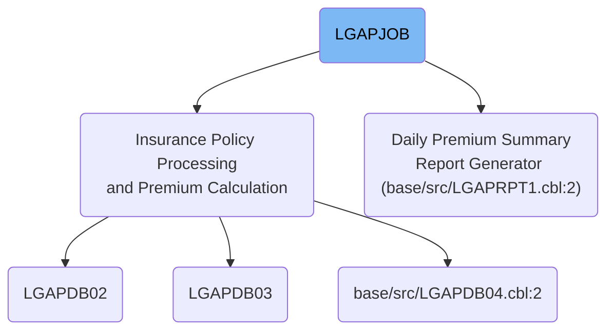
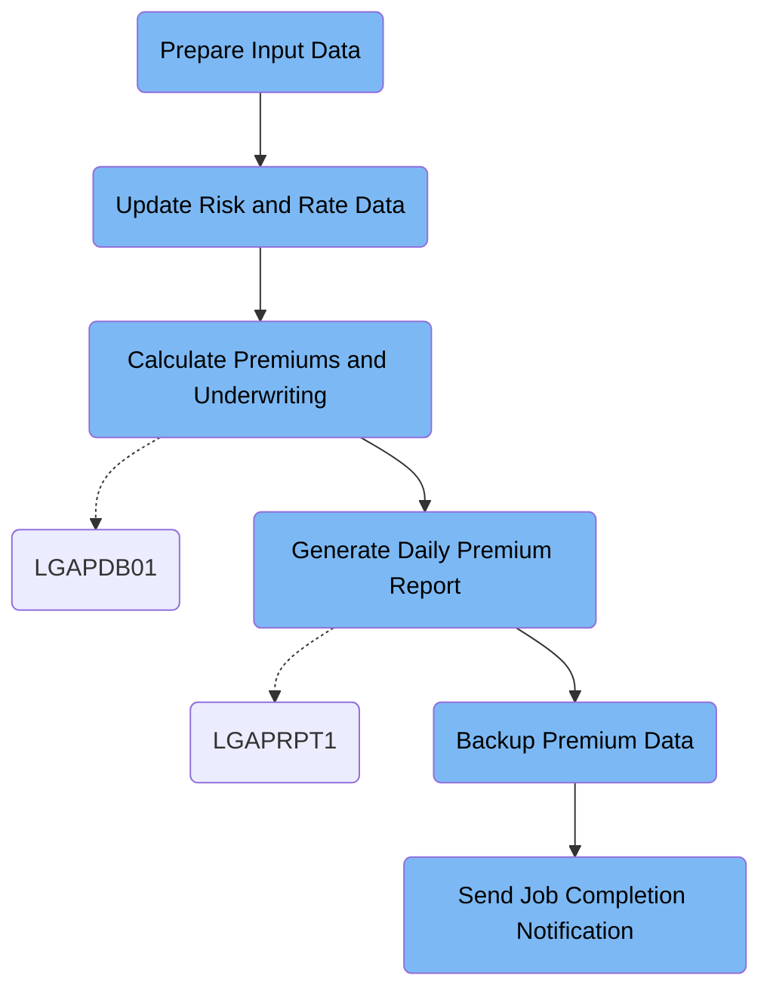

LGAPJOB performs daily insurance premium calculations by preparing input data, updating risk and rate tables, validating and processing policies, generating reports, backing up results, and notifying completion. It receives raw policy records and outputs calculated premiums, rejected policies, summary reports, and backups.

# Dependencies



Here is a high level diagram of the file:



## Prepare Input Data

Step in this section: <SwmToken path="/base/cntl/lgapjob.jcl" pos="23:1:1" line-data="//STEP01   EXEC PGM=SORT,REGION=2M" repo-id="Z2l0aHViJTNBJTNBY2ljcy1nZW5hcHAtZGVtbyUzQSUzQXN3aW1taW8=" repo-name="cics-genapp-demo">`STEP01`</SwmToken>.

Prepares raw insurance policy data by sorting and formatting it for reliable batch processing in subsequent premium calculation steps.

- The raw insurance policy records are read from the input dataset.
- Data is sorted using policy identifier and a validation field to ensure order and integrity.
- The output dataset is populated with the sorted and cleaned policy data, which is then usable for the next calculation steps.

### Input

<SwmToken path="/base/cntl/lgapjob.jcl" pos="25:7:13" line-data="//SORTIN   DD DSN=LGAP.INPUT.RAW.DATA,DISP=SHR" repo-id="Z2l0aHViJTNBJTNBY2ljcy1nZW5hcHAtZGVtbyUzQSUzQXN3aW1taW8=" repo-name="cics-genapp-demo">`LGAP.INPUT.RAW.DATA`</SwmToken> **(Raw Policy Data)**

Unsorted and unvalidated insurance policy records fed into the batch job.

### Output

<SwmToken path="/base/cntl/lgapjob.jcl" pos="26:7:11" line-data="//SORTOUT  DD DSN=LGAP.INPUT.SORTED,DISP=(NEW,PASS)," repo-id="Z2l0aHViJTNBJTNBY2ljcy1nZW5hcHAtZGVtbyUzQSUzQXN3aW1taW8=" repo-name="cics-genapp-demo">`LGAP.INPUT.SORTED`</SwmToken> **(Sorted Policy Data)**

Organized and validated insurance policy data, ready for further premium calculation processing.

## Update Risk and Rate Data

Step in this section: <SwmToken path="/base/cntl/lgapjob.jcl" pos="37:1:1" line-data="//STEP02   EXEC PGM=IKJEFT01,REGION=2M," repo-id="Z2l0aHViJTNBJTNBY2ljcy1nZW5hcHAtZGVtbyUzQSUzQXN3aW1taW8=" repo-name="cics-genapp-demo">`STEP02`</SwmToken>.

Refreshes database tables containing risk factors and rate information so that only up-to-date entries are available for accurate insurance premium calculation in subsequent steps.

- The process accesses the risk cache table and deletes all records with a load date earlier than one day before the current date, ensuring only recent risk data is retained.
- It then updates the rate master table by setting the status to 'ACTIVE' for every rate whose effective and expiry dates include today, ensuring that only up-to-date rates are flagged for use.
- The result is refreshed tables, containing only current, valid risk and rate entries, ready for accurate premium calculation in the following steps.

### Input

<SwmToken path="/base/cntl/lgapjob.jcl" pos="47:5:7" line-data="  DELETE FROM LGAP.RISK_CACHE WHERE LOAD_DATE &lt; CURRENT DATE - 1 DAYS;" repo-id="Z2l0aHViJTNBJTNBY2ljcy1nZW5hcHAtZGVtbyUzQSUzQXN3aW1taW8=" repo-name="cics-genapp-demo">`LGAP.RISK_CACHE`</SwmToken> **(Risk Factor Cache Table)**

Table containing temporary risk data entries used in premium calculations.

<SwmToken path="/base/cntl/lgapjob.jcl" pos="50:3:5" line-data="  UPDATE LGAP.RATE_MASTER " repo-id="Z2l0aHViJTNBJTNBY2ljcy1nZW5hcHAtZGVtbyUzQSUzQXN3aW1taW8=" repo-name="cics-genapp-demo">`LGAP.RATE_MASTER`</SwmToken> **(Rate Master Table)**

Table holding all rate-related data, including effective and expiry dates for each rate record.

### Output

<SwmToken path="/base/cntl/lgapjob.jcl" pos="47:5:7" line-data="  DELETE FROM LGAP.RISK_CACHE WHERE LOAD_DATE &lt; CURRENT DATE - 1 DAYS;" repo-id="Z2l0aHViJTNBJTNBY2ljcy1nZW5hcHAtZGVtbyUzQSUzQXN3aW1taW8=" repo-name="cics-genapp-demo">`LGAP.RISK_CACHE`</SwmToken> **(Risk Factor Cache Table (Updated))**

Table where outdated risk factor entries have been removed, leaving only valid entries for further calculations.

<SwmToken path="/base/cntl/lgapjob.jcl" pos="50:3:5" line-data="  UPDATE LGAP.RATE_MASTER " repo-id="Z2l0aHViJTNBJTNBY2ljcy1nZW5hcHAtZGVtbyUzQSUzQXN3aW1taW8=" repo-name="cics-genapp-demo">`LGAP.RATE_MASTER`</SwmToken> **(Rate Master Table (Updated))**

Table where rates currently in effect have been set as active, ensuring up-to-date rates for business use.

## Calculate Premiums and Underwriting

Step in this section: <SwmToken path="/base/cntl/lgapjob.jcl" pos="61:1:1" line-data="//STEP03   EXEC PGM=LGAPDB01,REGION=4M," repo-id="Z2l0aHViJTNBJTNBY2ljcy1nZW5hcHAtZGVtbyUzQSUzQXN3aW1taW8=" repo-name="cics-genapp-demo">`STEP03`</SwmToken>.

This section validates insurance policy records, applies current rate and configuration data, calculates premiums, and determines if the policies meet underwriting criteria. Results are output as accepted premium data, rejected policies, and a business summary report.

- The sorted input policy records are read sequentially.
- For each policy, the program uses configuration data to load applicable business rules and selects the correct insurance rates from the rate tables.
- Policy data is validated for completeness and cross-checked against underwriting rules; policies failing validation are output to the rejected file, along with a rejection reason.
- Accepted policies are processed using the insurance formulas to calculate premiums, referencing sum insured, risk codes, and rates.
- Calculated premium records (policy ID, premium value, status, risk info) are written to the premium data output file.
- Throughout the run, business metrics are accumulated (e.g., count of accepted/rejected, total premiums) and written to the summary report output at completion.

### Input

<SwmToken path="/base/cntl/lgapjob.jcl" pos="26:7:11" line-data="//SORTOUT  DD DSN=LGAP.INPUT.SORTED,DISP=(NEW,PASS)," repo-id="Z2l0aHViJTNBJTNBY2ljcy1nZW5hcHAtZGVtbyUzQSUzQXN3aW1taW8=" repo-name="cics-genapp-demo">`LGAP.INPUT.SORTED`</SwmToken> **(Sorted Policy Data)**

Sorted and validated insurance policy records, prepared in previous steps for batch premium calculation.

Sample:

| Column Name                                                                                                                                                                                                                                          | Sample      |
| ---------------------------------------------------------------------------------------------------------------------------------------------------------------------------------------------------------------------------------------------------- | ----------- |
| POLICY_ID                                                                                                                                                                                                                                            | 1002938819  |
| CUSTOMER_NAME                                                                                                                                                                                                                                        | SMITH TOM   |
| POLICY_TYPE                                                                                                                                                                                                                                          | COMMERCIAL  |
| SUM_INSURED                                                                                                                                                                                                                                          | 2500000     |
| <SwmToken path="/base/src/LGAPDB04.cbl" pos="188:3:3" line-data="                 AND EFFECTIVE_DATE &lt;= CURRENT DATE" repo-id="Z2l0aHViJTNBJTNBY2ljcy1nZW5hcHAtZGVtbyUzQSUzQXN3aW1taW8=" repo-name="cics-genapp-demo">`EFFECTIVE_DATE`</SwmToken> | 2024-07-01  |
| <SwmToken path="/base/src/LGAPDB04.cbl" pos="189:3:3" line-data="                 AND EXPIRY_DATE &gt;= CURRENT DATE" repo-id="Z2l0aHViJTNBJTNBY2ljcy1nZW5hcHAtZGVtbyUzQSUzQXN3aW1taW8=" repo-name="cics-genapp-demo">`EXPIRY_DATE`</SwmToken>       | 2025-07-01  |
| RISK_CODE                                                                                                                                                                                                                                            | FIRE-HAZARD |
| VALIDATION_FLAG                                                                                                                                                                                                                                      | Y           |

<SwmToken path="/base/cntl/lgapjob.jcl" pos="71:7:11" line-data="//CONFIG   DD DSN=LGAP.CONFIG.MASTER,DISP=SHR" repo-id="Z2l0aHViJTNBJTNBY2ljcy1nZW5hcHAtZGVtbyUzQSUzQXN3aW1taW8=" repo-name="cics-genapp-demo">`LGAP.CONFIG.MASTER`</SwmToken> **(Configuration File)**

Global and actuarial configuration settings controlling business rules and formulas for premium calculation.

<SwmToken path="/base/cntl/lgapjob.jcl" pos="72:7:11" line-data="//RATES    DD DSN=LGAP.RATE.TABLES,DISP=SHR" repo-id="Z2l0aHViJTNBJTNBY2ljcy1nZW5hcHAtZGVtbyUzQSUzQXN3aW1taW8=" repo-name="cics-genapp-demo">`LGAP.RATE.TABLES`</SwmToken> **(Rate Tables)**

Insurance rate tables containing actuarial rates and factors used in premium calculation.

### Output

<SwmToken path="/base/cntl/lgapjob.jcl" pos="75:7:13" line-data="//OUTPUT   DD DSN=LGAP.OUTPUT.PREMIUM.DATA," repo-id="Z2l0aHViJTNBJTNBY2ljcy1nZW5hcHAtZGVtbyUzQSUzQXN3aW1taW8=" repo-name="cics-genapp-demo">`LGAP.OUTPUT.PREMIUM.DATA`</SwmToken> **(Premium Data File)**

Calculated premium records for accepted commercial policies, ready for reporting and archival.

Sample:

| Column Name         | Sample      |
| ------------------- | ----------- |
| POLICY_ID           | 1002938819  |
| PREMIUM_CALC        | 18740.56    |
| UNDERWRITING_STATUS | ACCEPTED    |
| SUM_INSURED         | 2500000     |
| RISK_CODE           | FIRE-HAZARD |

<SwmToken path="/base/cntl/lgapjob.jcl" pos="79:7:13" line-data="//REJECTED DD DSN=LGAP.OUTPUT.REJECTED.DATA," repo-id="Z2l0aHViJTNBJTNBY2ljcy1nZW5hcHAtZGVtbyUzQSUzQXN3aW1taW8=" repo-name="cics-genapp-demo">`LGAP.OUTPUT.REJECTED.DATA`</SwmToken> **(Rejected Policies File)**

Records of policies rejected during premium calculation or underwriting due to validation or business rule failures.

Sample:

| Column Name   | Sample                 |
| ------------- | ---------------------- |
| POLICY_ID     | 1002938825             |
| REJECT_REASON | Insufficient Risk Info |

<SwmToken path="/base/cntl/lgapjob.jcl" pos="83:7:13" line-data="//SUMMARY  DD DSN=LGAP.OUTPUT.SUMMARY.RPT," repo-id="Z2l0aHViJTNBJTNBY2ljcy1nZW5hcHAtZGVtbyUzQSUzQXN3aW1taW8=" repo-name="cics-genapp-demo">`LGAP.OUTPUT.SUMMARY.RPT`</SwmToken> **(Processing Summary Report)**

Business summary report on premium calculation and underwriting results for management review.

Sample:

```
Total Policies: 240
Accepted: 230
Rejected: 10
Total Premiums: $3,520,450.20
```

## Generate Daily Premium Report

Step in this section: <SwmToken path="/base/cntl/lgapjob.jcl" pos="99:1:1" line-data="//STEP04   EXEC PGM=LGAPRPT1,REGION=2M," repo-id="Z2l0aHViJTNBJTNBY2ljcy1nZW5hcHAtZGVtbyUzQSUzQXN3aW1taW8=" repo-name="cics-genapp-demo">`STEP04`</SwmToken>.

Generates a comprehensive daily report from all insurance premium transactions, summarizing policy, premium totals, and classification statistics for business review.

- The program reads each transaction from <SwmToken path="/base/cntl/lgapjob.jcl" pos="75:7:13" line-data="//OUTPUT   DD DSN=LGAP.OUTPUT.PREMIUM.DATA," repo-id="Z2l0aHViJTNBJTNBY2ljcy1nZW5hcHAtZGVtbyUzQSUzQXN3aW1taW8=" repo-name="cics-genapp-demo">`LGAP.OUTPUT.PREMIUM.DATA`</SwmToken>, extracting relevant fields such as policy ID, premium value, risk code, and underwriting status.
- It tallies the total number of policies, counts accepted and rejected cases, and sums the premium values.
- For each risk code and policy type, the program aggregates statistics including the number of policies and total premiums.
- It composes a formatted report header with the current date, includes overall summary totals, then appends breakdown sections for risk/classification statistics and relevant highlights for management.
- The final output is written as a daily summary to <SwmToken path="/base/cntl/lgapjob.jcl" pos="104:7:13" line-data="//REPORT   DD DSN=LGAP.REPORTS.DAILY.SUMMARY," repo-id="Z2l0aHViJTNBJTNBY2ljcy1nZW5hcHAtZGVtbyUzQSUzQXN3aW1taW8=" repo-name="cics-genapp-demo">`LGAP.REPORTS.DAILY.SUMMARY`</SwmToken> for business review.

### Input

<SwmToken path="/base/cntl/lgapjob.jcl" pos="75:7:13" line-data="//OUTPUT   DD DSN=LGAP.OUTPUT.PREMIUM.DATA," repo-id="Z2l0aHViJTNBJTNBY2ljcy1nZW5hcHAtZGVtbyUzQSUzQXN3aW1taW8=" repo-name="cics-genapp-demo">`LGAP.OUTPUT.PREMIUM.DATA`</SwmToken> **(Insurance Premium Transaction Records)**

Contains all premium calculations for accepted policies from daily batch processing, including policy ID, premium amount, sum insured, risk classification, and underwriting status.

Sample:

| Column Name         | Sample      |
| ------------------- | ----------- |
| POLICY_ID           | 1002938819  |
| PREMIUM_CALC        | 18740.56    |
| UNDERWRITING_STATUS | ACCEPTED    |
| SUM_INSURED         | 2500000     |
| RISK_CODE           | FIRE-HAZARD |

### Output

<SwmToken path="/base/cntl/lgapjob.jcl" pos="104:7:13" line-data="//REPORT   DD DSN=LGAP.REPORTS.DAILY.SUMMARY," repo-id="Z2l0aHViJTNBJTNBY2ljcy1nZW5hcHAtZGVtbyUzQSUzQXN3aW1taW8=" repo-name="cics-genapp-demo">`LGAP.REPORTS.DAILY.SUMMARY`</SwmToken> **(Daily Premium Summary Report)**

Formatted management report detailing premium statistics, accepted/rejected counts, and summary breakdowns for today's insurance activity.

Sample:

```
Daily Premium Summary Report - 2024-07-01
-----------------------------------------
Total Policies: 240
Accepted: 230
Rejected: 10
Total Premiums: $3,520,450.20
Breakdown by Risk Type:
  FIRE-HAZARD: 140 policies, $2,430,800.00
  THEFT: 90 policies, $1,089,650.20

End of Report
```

## Backup Premium Data

Step in this section: <SwmToken path="/base/cntl/lgapjob.jcl" pos="112:1:1" line-data="//STEP05   EXEC PGM=IEBGENER,REGION=1M," repo-id="Z2l0aHViJTNBJTNBY2ljcy1nZW5hcHAtZGVtbyUzQSUzQXN3aW1taW8=" repo-name="cics-genapp-demo">`STEP05`</SwmToken>.

This section copies the completed premium data output into a dedicated backup dataset, ensuring the information remains available for future audits, recovery, and reference.

- The premium data file produced earlier with daily calculation results, including policy details and premium amounts, serves as the input.
- The IEBGENER utility reads the full contents of the premium data file line by line.
- An exact duplicate of each record, containing all original data fields, is written to the designated backup tape dataset.
- This process ensures the backup dataset is a complete, direct copy of the day's premium calculation results, retaining all details for audit and recovery.

### Input

<SwmToken path="/base/cntl/lgapjob.jcl" pos="75:7:13" line-data="//OUTPUT   DD DSN=LGAP.OUTPUT.PREMIUM.DATA," repo-id="Z2l0aHViJTNBJTNBY2ljcy1nZW5hcHAtZGVtbyUzQSUzQXN3aW1taW8=" repo-name="cics-genapp-demo">`LGAP.OUTPUT.PREMIUM.DATA`</SwmToken>

Contains all calculated premium details for accepted policies, generated during daily batch processing.

Sample:

| Column Name         | Sample      |
| ------------------- | ----------- |
| POLICY_ID           | 1002938819  |
| PREMIUM_CALC        | 18740.56    |
| UNDERWRITING_STATUS | ACCEPTED    |
| SUM_INSURED         | 2500000     |
| RISK_CODE           | FIRE-HAZARD |

### Output

<SwmToken path="/base/cntl/lgapjob.jcl" pos="117:7:13" line-data="//SYSUT2   DD DSN=LGAP.BACKUP.PREMIUM.G0001V00," repo-id="Z2l0aHViJTNBJTNBY2ljcy1nZW5hcHAtZGVtbyUzQSUzQXN3aW1taW8=" repo-name="cics-genapp-demo">`LGAP.BACKUP.PREMIUM.G0001V00`</SwmToken>

Dedicated backup copy of daily premium data, securely stored on tape for future use and audit requirements.

Sample:

| Column Name         | Sample      |
| ------------------- | ----------- |
| POLICY_ID           | 1002938819  |
| PREMIUM_CALC        | 18740.56    |
| UNDERWRITING_STATUS | ACCEPTED    |
| SUM_INSURED         | 2500000     |
| RISK_CODE           | FIRE-HAZARD |

## Send Job Completion Notification

Step in this section: <SwmToken path="/base/cntl/lgapjob.jcl" pos="5:2:2" line-data="//         NOTIFY=&amp;SYSUID," repo-id="Z2l0aHViJTNBJTNBY2ljcy1nZW5hcHAtZGVtbyUzQSUzQXN3aW1taW8=" repo-name="cics-genapp-demo">`NOTIFY`</SwmToken>.

The section provides a clear notification for business and IT staff that the daily insurance premium batch process has finished successfully, detailing where the results and backup can be found.

- The notification text is defined directly in the job step and includes explicit statements for operational awareness (job completion, summary location, backup confirmation).
- The utility step writes this message into the system's processing queue, targeting operational monitoring services and job automation tools.
- Staff and dependent processes use this message to confirm that outputs are available and the batch workflow succeeded.

### Output

<SwmToken path="/base/cntl/lgapjob.jcl" pos="117:1:1" line-data="//SYSUT2   DD DSN=LGAP.BACKUP.PREMIUM.G0001V00," repo-id="Z2l0aHViJTNBJTNBY2ljcy1nZW5hcHAtZGVtbyUzQSUzQXN3aW1taW8=" repo-name="cics-genapp-demo">`SYSUT2`</SwmToken> **(Batch Completion Notification)**

Notification message delivered to operations and processing queues, confirming successful completion and providing directions to summary and backup data.

Sample:

```
JOB LGAPJOB COMPLETED SUCCESSFULLY
PROCESSING SUMMARY AVAILABLE IN LGAP.OUTPUT.SUMMARY.RPT
BACKUP CREATED: LGAP.BACKUP.PREMIUM.G0001V00
```

&nbsp;

*This is an auto-generated document by Swimm 🌊 and has not yet been verified by a human*

<SwmMeta version="3.0.0" repo-id="Z2l0aHViJTNBJTNBa3luZHJ5bC1jaWNzLWdlbmFwcCUzQSUzQVN3aW1tLURlbW8=" repo-name="kyndryl-cics-genapp"><sup>Powered by [Swimm](https://app.swimm.io/)</sup></SwmMeta>
