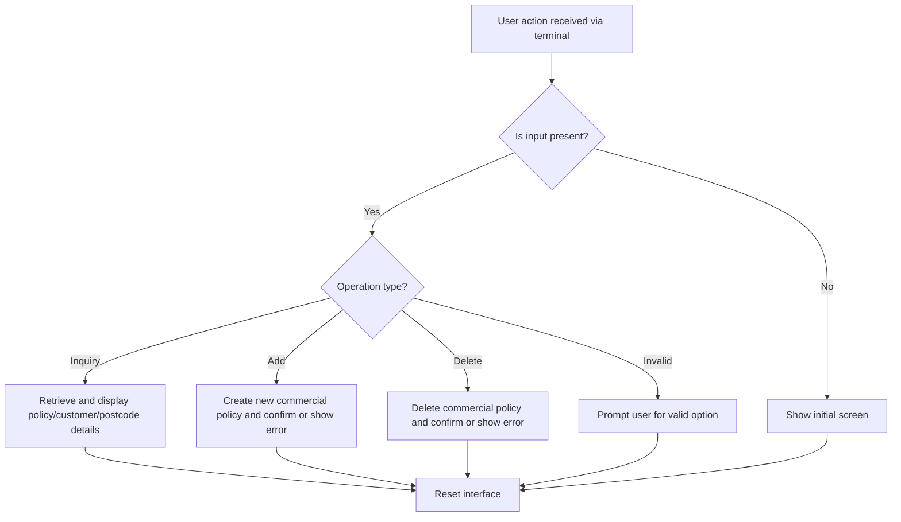
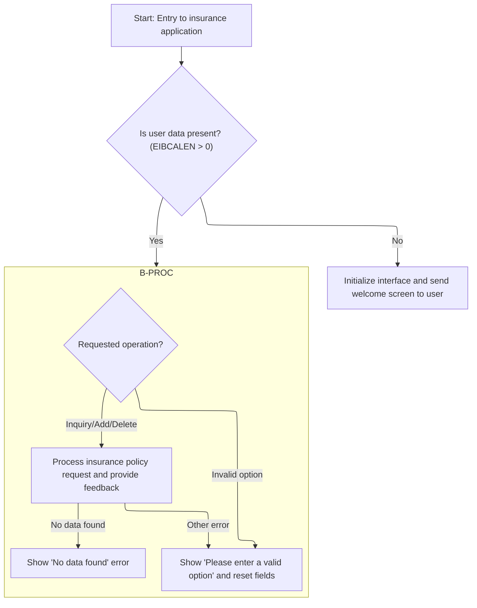
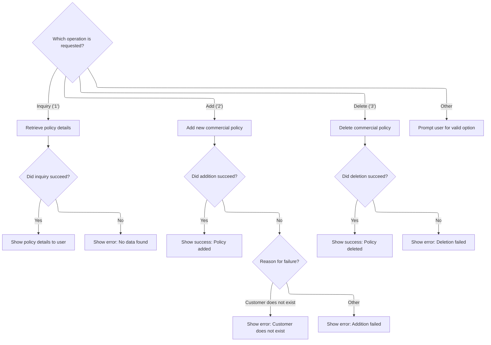

# Program Overview

<SwmToken path="base/src/lgtestp4.cbl" pos="2:6:6" line-data="       PROGRAM-ID. LGTESTP4.">`LGTESTP4`</SwmToken> handles user-driven insurance policy operations, including inquiry, addition, and deletion of commercial policies. It receives user actions and data from the terminal, determines the requested operation, and coordinates with backend modules to process the request. The program displays policy details, confirmation, or error messages, and ensures the interface is ready for the next transaction.

Main steps:

- Check for user input or initialize the screen
- Process inquiry, add, or delete requests
- Display results or errors to the user
- Reset the interface for the next transaction

## Screen preview

The screen looks roughly like this:

&nbsp;

<p align="center"></p>

# Main flow



## Dependencies

### Programs

- <SwmToken path="base/src/lgtestp4.cbl" pos="112:10:10" line-data="                 EXEC CICS LINK PROGRAM(&#39;LGIPOL01&#39;)">`LGIPOL01`</SwmToken> (<SwmPath>[base/src/lgipol01.cbl](base/src/lgipol01.cbl)</SwmPath>)
- <SwmToken path="/base/src/lgipol01.cbl" pos="53:3:3" line-data="       01 LGIPDB01                     PIC x(8) Value &#39;LGIPDB01&#39;.">`LGIPDB01`</SwmToken> (<SwmPath>[base/src/lgipdb01.cbl](base/src/lgipdb01.cbl)</SwmPath>)
- LGSTSQ (<SwmPath>[base/src/lgstsq.cbl](base/src/lgstsq.cbl)</SwmPath>)
- <SwmToken path="base/src/lgtestp4.cbl" pos="168:10:10" line-data="                 EXEC CICS LINK PROGRAM(&#39;LGAPOL01&#39;)">`LGAPOL01`</SwmToken> (<SwmPath>[base/src/lgapol01.cbl](base/src/lgapol01.cbl)</SwmPath>)
- <SwmToken path="/base/src/lgapol01.cbl" pos="39:3:3" line-data="       01  LGAPDB01                    PIC X(8)  VALUE &#39;LGAPDB01&#39;.">`LGAPDB01`</SwmToken> (<SwmPath>[base/src/LGAPDB01.cbl](base/src/LGAPDB01.cbl)</SwmPath>)
- <SwmToken path="/base/src/LGAPDB01.cbl" pos="269:4:4" line-data="           CALL &#39;LGAPDB02&#39; USING IN-PROPERTY-TYPE, IN-POSTCODE, ">`LGAPDB02`</SwmToken>
- <SwmToken path="/base/src/LGAPDB01.cbl" pos="276:4:4" line-data="           CALL &#39;LGAPDB03&#39; USING WS-BASE-RISK-SCR, IN-FIRE-PERIL, ">`LGAPDB03`</SwmToken> (<SwmPath>[base/src/LGAPDB03.cbl](base/src/LGAPDB03.cbl)</SwmPath>)
- <SwmToken path="/base/src/LGAPDB01.cbl" pos="313:4:4" line-data="               CALL &#39;LGAPDB04&#39; USING LK-INPUT-DATA, LK-COVERAGE-DATA, ">`LGAPDB04`</SwmToken> (<SwmPath>[base/src/LGAPDB04.cbl](base/src/LGAPDB04.cbl)</SwmPath>)
- <SwmToken path="base/src/lgtestp4.cbl" pos="191:10:10" line-data="                 EXEC CICS LINK PROGRAM(&#39;LGDPOL01&#39;)">`LGDPOL01`</SwmToken> (<SwmPath>[base/src/lgdpol01.cbl](base/src/lgdpol01.cbl)</SwmPath>)
- <SwmToken path="/base/src/lgdpol01.cbl" pos="59:3:3" line-data="       01 LGDPDB01                  PIC x(8) Value &#39;LGDPDB01&#39;.">`LGDPDB01`</SwmToken> (<SwmPath>[base/src/lgdpdb01.cbl](base/src/lgdpdb01.cbl)</SwmPath>)
- <SwmToken path="/base/src/lgdpdb01.cbl" pos="59:3:3" line-data="       01 LGDPVS01                  PIC x(8) Value &#39;LGDPVS01&#39;.">`LGDPVS01`</SwmToken> (<SwmPath>[base/src/lgdpvs01.cbl](base/src/lgdpvs01.cbl)</SwmPath>)

### Copybooks

- SQLCA
- LGPOLICY (<SwmPath>[base/src/lgpolicy.cpy](base/src/lgpolicy.cpy)</SwmPath>)
- LGCMAREA (<SwmPath>[base/src/lgcmarea.cpy](base/src/lgcmarea.cpy)</SwmPath>)
- <SwmToken path="/base/src/LGAPDB01.cbl" pos="35:3:3" line-data="           COPY INPUTREC2.">`INPUTREC2`</SwmToken> (<SwmPath>[base/src/INPUTREC2.cpy](base/src/INPUTREC2.cpy)</SwmPath>)
- OUTPUTREC (<SwmPath>[base/src/OUTPUTREC.cpy](base/src/OUTPUTREC.cpy)</SwmPath>)
- WORKSTOR (<SwmPath>[base/src/WORKSTOR.cpy](base/src/WORKSTOR.cpy)</SwmPath>)
- LGAPACT (<SwmPath>[base/src/LGAPACT.cpy](base/src/LGAPACT.cpy)</SwmPath>)
- XMAP

# Program Workflow

# Entry Point and Request Routing



## Processing User Actions

```mermaid
%%{init: {"flowchart": {"defaultRenderer": "elk"}} }%%
flowchart TD
  node1{"Requested operation?"}
  click node1 openCode "base/src/lgtestp4.cbl:80:111"
  node1 -->|"Inquiry/Add/Delete"| node4["Process insurance policy request and provide feedback"]
  click node4 openCode "base/src/lgtestp4.cbl:162:224"
  node1 -->|"Invalid option"| node3["Show 'Please enter a valid option' and reset fields"]
  click node3 openCode "base/src/lgtestp4.cbl:226:237"
  node4 -->|"No data found"| node2["Show 'No data found' error"]
  click node2 openCode "base/src/lgtestp4.cbl:293:295"
  node4 -->|"Other error"| node3


subgraph node2 [E-NODAT]
  sgmain_1_node0{"Was any data found?"}
  sgmain_1_node0 -->|"No"| sgmain_1_node1["Inform user: 'No data was returned.'"]
  click sgmain_1_node1 openCode "base/src/lgtestp4.cbl:293:295"
end

subgraph node3 [F-ERR]
  sgmain_2_node1["Show error message to user (XMAPP4 map, XMAPP4O content)"] --> sgmain_2_node2["Reset application data (XMAPP4I, XMAPP4O, COMM-AREA)"] --> sgmain_2_node3["Resume main workflow"]
  click sgmain_2_node1 openCode "base/src/lgtestp4.cbl:298:301"
  click sgmain_2_node2 openCode "base/src/lgtestp4.cbl:303:305"
  click sgmain_2_node3 openCode "base/src/lgtestp4.cbl:307:307"
end

%% Swimm:
%% %%{init: {"flowchart": {"defaultRenderer": "elk"}} }%%
%% flowchart TD
%%   node1{"Requested operation?"}
%%   click node1 openCode "<SwmPath>[base/src/lgtestp4.cbl](base/src/lgtestp4.cbl)</SwmPath>:80:111"
%%   node1 -->|"Inquiry/Add/Delete"| node4["Process insurance policy request and provide feedback"]
%%   click node4 openCode "<SwmPath>[base/src/lgtestp4.cbl](base/src/lgtestp4.cbl)</SwmPath>:162:224"
%%   node1 -->|"Invalid option"| node3["Show 'Please enter a valid option' and reset fields"]
%%   click node3 openCode "<SwmPath>[base/src/lgtestp4.cbl](base/src/lgtestp4.cbl)</SwmPath>:226:237"
%%   node4 -->|"No data found"| node2["Show 'No data found' error"]
%%   click node2 openCode "<SwmPath>[base/src/lgtestp4.cbl](base/src/lgtestp4.cbl)</SwmPath>:293:295"
%%   node4 -->|"Other error"| node3
%% 
%% 
%% subgraph node2 [<SwmToken path="base/src/lgtestp4.cbl" pos="117:5:7" line-data="                   GO TO E-NODAT">`E-NODAT`</SwmToken>]
%%   sgmain_1_node0{"Was any data found?"}
%%   sgmain_1_node0 -->|"No"| sgmain_1_node1["Inform user: 'No data was returned.'"]
%%   click sgmain_1_node1 openCode "<SwmPath>[base/src/lgtestp4.cbl](base/src/lgtestp4.cbl)</SwmPath>:293:295"
%% end
%% 
%% subgraph node3 [<SwmToken path="base/src/lgtestp4.cbl" pos="279:5:7" line-data="               Go To F-ERR">`F-ERR`</SwmToken>]
%%   sgmain_2_node1["Show error message to user (<SwmToken path="base/src/lgtestp4.cbl" pos="42:11:11" line-data="           EXEC CICS SEND MAP (&#39;XMAPP4&#39;)">`XMAPP4`</SwmToken> map, <SwmToken path="base/src/lgtestp4.cbl" pos="27:3:3" line-data="           Initialize XMAPP4O.">`XMAPP4O`</SwmToken> content)"] --> sgmain_2_node2["Reset application data (<SwmToken path="base/src/lgtestp4.cbl" pos="26:3:3" line-data="           Initialize XMAPP4I.">`XMAPP4I`</SwmToken>, <SwmToken path="base/src/lgtestp4.cbl" pos="27:3:3" line-data="           Initialize XMAPP4O.">`XMAPP4O`</SwmToken>, <SwmToken path="base/src/lgtestp4.cbl" pos="28:3:5" line-data="           Initialize COMM-AREA.">`COMM-AREA`</SwmToken>)"] --> sgmain_2_node3["Resume main workflow"]
%%   click sgmain_2_node1 openCode "<SwmPath>[base/src/lgtestp4.cbl](base/src/lgtestp4.cbl)</SwmPath>:298:301"
%%   click sgmain_2_node2 openCode "<SwmPath>[base/src/lgtestp4.cbl](base/src/lgtestp4.cbl)</SwmPath>:303:305"
%%   click sgmain_2_node3 openCode "<SwmPath>[base/src/lgtestp4.cbl](base/src/lgtestp4.cbl)</SwmPath>:307:307"
%% end
```



<SwmSnippet path="/base/src/lgtestp4.cbl" line="80">

---

In <SwmToken path="base/src/lgtestp4.cbl" pos="24:5:7" line-data="              GO TO B-PROC.">`B-PROC`</SwmToken> we start by checking which input fields are present to decide what kind of request to make (policy, customer, or postcode inquiry). We set up the request ID and relevant fields, then call <SwmToken path="base/src/lgtestp4.cbl" pos="112:10:10" line-data="                 EXEC CICS LINK PROGRAM(&#39;LGIPOL01&#39;)">`LGIPOL01`</SwmToken> to fetch details. If <SwmToken path="base/src/lgtestp4.cbl" pos="112:10:10" line-data="                 EXEC CICS LINK PROGRAM(&#39;LGIPOL01&#39;)">`LGIPOL01`</SwmToken> doesn't return data (<SwmToken path="base/src/lgtestp4.cbl" pos="116:3:7" line-data="                 IF CA-RETURN-CODE &gt; 0">`CA-RETURN-CODE`</SwmToken> > 0), we jump to <SwmToken path="base/src/lgtestp4.cbl" pos="117:5:7" line-data="                   GO TO E-NODAT">`E-NODAT`</SwmToken> to display an error and prep for the next transaction.

```cobol
                 Else
                 If (
                     ENP4PNOO Not = Spaces      AND
                     ENP4PNOO Not = Low-Values  AND
                     ENP4PNOO Not = 0           AND
                     ENP4PNOO Not = 0000000000
                                                   )
                        Move '02ICOM'   To CA-REQUEST-ID
                        Move ENP4PNOO   To CA-POLICY-NUM
                 Else
                 If (
                     ENP4CNOO Not = Spaces      AND
                     ENP4CNOO Not = Low-Values  AND
                     ENP4CNOO Not = 0           AND
                     ENP4CNOO Not = 0000000000
                                                   )
                        Move '03ICOM'   To CA-REQUEST-ID
                        Move ENP4CNOO   To CA-CUSTOMER-NUM
                 Else
                 If (
                     ENP4HPCO NOT = Spaces      AND
                     ENP4HPCO NOT = Low-Values  AND
                     ENP4HPCO Not = 0           AND
                     ENP4HPCO NOT = 00000000
                                                   )
                        Move '05ICOM'   To CA-REQUEST-ID
                        Move ENP4HPCO   To CA-B-PST
                 End-If
                 End-If
                 End-If
                 End-If

                 EXEC CICS LINK PROGRAM('LGIPOL01')
                           COMMAREA(COMM-AREA)
                           LENGTH(32500)
                 END-EXEC
                 IF CA-RETURN-CODE > 0
                   GO TO E-NODAT
                 END-IF
              
                 Move CA-POLICY-NUM        To  ENP4PNOI
                 Move CA-CUSTOMER-NUM      To  ENP4CNOI
                 Move CA-ISSUE-DATE        To  ENP4IDAI
                 Move CA-EXPIRY-DATE       To  ENP4EDAI
                 Move CA-B-Address         To  ENP4ADDI
                 Move CA-B-PST        To  ENP4HPCI
                 Move CA-B-Latitude        To  ENP4LATI
                 Move CA-B-Longitude       To  ENP4LONI
                 Move CA-B-Customer        To  ENP4CUSI
                 Move CA-B-PropType        To  ENP4PTYI
                 Move CA-B-FP       To  ENP4FPEI
                 Move CA-B-CA-B-FPR     To  ENP4FPRI
                 Move CA-B-CP      To  ENP4CPEI
                 Move CA-B-CPR    To  ENP4CPRI
                 Move CA-B-FLP      To  ENP4XPEI
                 Move CA-B-FLPR    To  ENP4XPRI
                 Move CA-B-WP    To  ENP4WPEI
                 Move CA-B-WPR  To  ENP4WPRI
                 Move CA-B-ST          To  ENP4STAI
                 Move CA-B-RejectReason    To  ENP4REJI
                 EXEC CICS SEND MAP ('XMAPP4')
                           FROM(XMAPP4O)
                           MAPSET ('XMAP')
                 END-EXEC
                 GO TO D-EXEC

             WHEN '2'
                 Move '01ACOM'             To  CA-REQUEST-ID
                 Move ENP4CNOO             To  CA-CUSTOMER-NUM
                 Move ENP4IDAO             To  CA-ISSUE-DATE
                 Move ENP4EDAO             To  CA-EXPIRY-DATE
                 Move ENP4ADDO             To  CA-B-Address
                 Move ENP4HPCO             To  CA-B-PST
                 Move ENP4LATO             To  CA-B-Latitude
                 Move ENP4LONO             To  CA-B-Longitude
                 Move ENP4CUSO             To  CA-B-Customer
                 Move ENP4PTYO             To  CA-B-PropType
                 Move ENP4FPEO             To  CA-B-FP
                 Move ENP4FPRO             To  CA-B-CA-B-FPR
                 Move ENP4CPEO             To  CA-B-CP
                 Move ENP4CPRO             To  CA-B-CPR
                 Move ENP4XPEO             To  CA-B-FLP
                 Move ENP4XPRO             To  CA-B-FLPR
                 Move ENP4WPEO             To  CA-B-WP
                 Move ENP4WPRO             To  CA-B-WPR
                 Move ENP4STAO             To  CA-B-ST
                 Move ENP4REJO             To  CA-B-RejectReason

                 EXEC CICS LINK PROGRAM('LGAPOL01')
                           COMMAREA(COMM-AREA)
                           LENGTH(32500)
                 END-EXEC
                 IF CA-RETURN-CODE > 0
                   Exec CICS Syncpoint Rollback End-Exec
                   GO TO E-NOADD
                 END-IF
                 Move CA-CUSTOMER-NUM To ENP4CNOI
                 Move CA-POLICY-NUM   To ENP4PNOI
                 Move ' '             To ENP4OPTI
                 Move 'New Commercial Policy Inserted'
                   To  ERP4FLDO
                 EXEC CICS SEND MAP ('XMAPP4')
                           FROM(XMAPP4O)
                           MAPSET ('XMAP')
                 END-EXEC
                 GO TO D-EXEC

             WHEN '3'
                 Move '01DCOM'   To CA-REQUEST-ID
                 Move ENP4CNOO   To CA-CUSTOMER-NUM
                 Move ENP4PNOO   To CA-POLICY-NUM
                 EXEC CICS LINK PROGRAM('LGDPOL01')
```

---

</SwmSnippet>

### Handling Missing Inquiry Data

<SwmSnippet path="/base/src/lgtestp4.cbl" line="293">

---

<SwmToken path="base/src/lgtestp4.cbl" pos="293:1:3" line-data="       E-NODAT.">`E-NODAT`</SwmToken> sets the error message for no data found and immediately jumps to <SwmToken path="base/src/lgtestp4.cbl" pos="295:5:7" line-data="           Go To F-ERR.">`F-ERR`</SwmToken>, which will show the error screen and reset everything for the next transaction.

```cobol
       E-NODAT.
           Move 'No data was returned.'              To  ERP4FLDO
           Go To F-ERR.
```

---

</SwmSnippet>

### Displaying Error Screen

<SwmSnippet path="/base/src/lgtestp4.cbl" line="297">

---

In <SwmToken path="base/src/lgtestp4.cbl" pos="297:1:3" line-data="       F-ERR.">`F-ERR`</SwmToken> we send the <SwmToken path="base/src/lgtestp4.cbl" pos="298:11:11" line-data="           EXEC CICS SEND MAP (&#39;XMAPP4&#39;)">`XMAPP4`</SwmToken> map to the terminal using the <SwmToken path="base/src/lgtestp4.cbl" pos="299:3:3" line-data="                     FROM(XMAPP4O)">`XMAPP4O`</SwmToken> data, which shows the error message and resets the UI for the user.

```cobol
       F-ERR.
           EXEC CICS SEND MAP ('XMAPP4')
                     FROM(XMAPP4O)
                     MAPSET ('XMAP')
           END-EXEC.
```

---

</SwmSnippet>

<SwmSnippet path="/base/src/lgtestp4.cbl" line="303">

---

After showing the error screen, we clear the input/output and commarea structures, then jump to <SwmToken path="base/src/lgtestp4.cbl" pos="307:5:7" line-data="           GO TO D-EXEC.">`D-EXEC`</SwmToken> to return control to CICS and trigger the next transaction.

```cobol
           Initialize XMAPP4I.
           Initialize XMAPP4O.
           Initialize COMM-AREA.

           GO TO D-EXEC.
```

---

</SwmSnippet>

### Handling Add and Delete Operations



<SwmSnippet path="/base/src/lgtestp4.cbl" line="162">

---

<SwmToken path="base/src/lgtestp4.cbl" pos="174:5:7" line-data="                   GO TO E-NOADD">`E-NOADD`</SwmToken> checks the return code from the add operation, sets the right error message, and jumps to <SwmToken path="base/src/lgtestp4.cbl" pos="279:5:7" line-data="               Go To F-ERR">`F-ERR`</SwmToken> to display it and reset the screen.

```cobol
                 Move ENP4XPRO             To  CA-B-FLPR
                 Move ENP4WPEO             To  CA-B-WP
                 Move ENP4WPRO             To  CA-B-WPR
                 Move ENP4STAO             To  CA-B-ST
                 Move ENP4REJO             To  CA-B-RejectReason

                 EXEC CICS LINK PROGRAM('LGAPOL01')
                           COMMAREA(COMM-AREA)
                           LENGTH(32500)
                 END-EXEC
                 IF CA-RETURN-CODE > 0
                   Exec CICS Syncpoint Rollback End-Exec
                   GO TO E-NOADD
                 END-IF
                 Move CA-CUSTOMER-NUM To ENP4CNOI
                 Move CA-POLICY-NUM   To ENP4PNOI
                 Move ' '             To ENP4OPTI
                 Move 'New Commercial Policy Inserted'
                   To  ERP4FLDO
                 EXEC CICS SEND MAP ('XMAPP4')
                           FROM(XMAPP4O)
```

---

</SwmSnippet>

<SwmSnippet path="/base/src/lgtestp4.cbl" line="275">

---

Back in <SwmToken path="base/src/lgtestp4.cbl" pos="24:5:7" line-data="              GO TO B-PROC.">`B-PROC`</SwmToken>, after handling add errors, we move on to delete logic. We call <SwmToken path="base/src/lgtestp4.cbl" pos="191:10:10" line-data="                 EXEC CICS LINK PROGRAM(&#39;LGDPOL01&#39;)">`LGDPOL01`</SwmToken> to process the delete, and if it fails, we roll back and jump to <SwmToken path="base/src/lgtestp4.cbl" pos="197:5:7" line-data="                   GO TO E-NODEL">`E-NODEL`</SwmToken> to handle the error.

```cobol
       E-NOADD.
           Evaluate CA-RETURN-CODE
             When 70
               Move 'Customer does not exist'        To  ERP4FLDO
               Go To F-ERR
             When Other
               Move 'Error Adding Commercial Policy' To  ERP4FLDO
               Go To F-ERR
           End-Evaluate.
```

---

</SwmSnippet>

<SwmSnippet path="/base/src/lgtestp4.cbl" line="89">

---

<SwmToken path="base/src/lgtestp4.cbl" pos="197:5:7" line-data="                   GO TO E-NODEL">`E-NODEL`</SwmToken> sets the error message for a failed delete and jumps to <SwmToken path="base/src/lgtestp4.cbl" pos="279:5:7" line-data="               Go To F-ERR">`F-ERR`</SwmToken> to display it and reset everything.

```cobol
                 Else
                 If (
                     ENP4CNOO Not = Spaces      AND
                     ENP4CNOO Not = Low-Values  AND
                     ENP4CNOO Not = 0           AND
                     ENP4CNOO Not = 0000000000
                                                   )
                        Move '03ICOM'   To CA-REQUEST-ID
                        Move ENP4CNOO   To CA-CUSTOMER-NUM
                 Else
                 If (
                     ENP4HPCO NOT = Spaces      AND
                     ENP4HPCO NOT = Low-Values  AND
                     ENP4HPCO Not = 0           AND
                     ENP4HPCO NOT = 00000000
                                                   )
                        Move '05ICOM'   To CA-REQUEST-ID
                        Move ENP4HPCO   To CA-B-PST
                 End-If
                 End-If
                 End-If
                 End-If

                 EXEC CICS LINK PROGRAM('LGIPOL01')
                           COMMAREA(COMM-AREA)
                           LENGTH(32500)
                 END-EXEC
                 IF CA-RETURN-CODE > 0
                   GO TO E-NODAT
                 END-IF
              
                 Move CA-POLICY-NUM        To  ENP4PNOI
                 Move CA-CUSTOMER-NUM      To  ENP4CNOI
                 Move CA-ISSUE-DATE        To  ENP4IDAI
                 Move CA-EXPIRY-DATE       To  ENP4EDAI
                 Move CA-B-Address         To  ENP4ADDI
                 Move CA-B-PST        To  ENP4HPCI
                 Move CA-B-Latitude        To  ENP4LATI
                 Move CA-B-Longitude       To  ENP4LONI
                 Move CA-B-Customer        To  ENP4CUSI
                 Move CA-B-PropType        To  ENP4PTYI
                 Move CA-B-FP       To  ENP4FPEI
                 Move CA-B-CA-B-FPR     To  ENP4FPRI
                 Move CA-B-CP      To  ENP4CPEI
                 Move CA-B-CPR    To  ENP4CPRI
                 Move CA-B-FLP      To  ENP4XPEI
                 Move CA-B-FLPR    To  ENP4XPRI
                 Move CA-B-WP    To  ENP4WPEI
                 Move CA-B-WPR  To  ENP4WPRI
                 Move CA-B-ST          To  ENP4STAI
                 Move CA-B-RejectReason    To  ENP4REJI
                 EXEC CICS SEND MAP ('XMAPP4')
                           FROM(XMAPP4O)
                           MAPSET ('XMAP')
                 END-EXEC
                 GO TO D-EXEC

             WHEN '2'
                 Move '01ACOM'             To  CA-REQUEST-ID
                 Move ENP4CNOO             To  CA-CUSTOMER-NUM
                 Move ENP4IDAO             To  CA-ISSUE-DATE
                 Move ENP4EDAO             To  CA-EXPIRY-DATE
                 Move ENP4ADDO             To  CA-B-Address
                 Move ENP4HPCO             To  CA-B-PST
                 Move ENP4LATO             To  CA-B-Latitude
                 Move ENP4LONO             To  CA-B-Longitude
                 Move ENP4CUSO             To  CA-B-Customer
                 Move ENP4PTYO             To  CA-B-PropType
                 Move ENP4FPEO             To  CA-B-FP
                 Move ENP4FPRO             To  CA-B-CA-B-FPR
                 Move ENP4CPEO             To  CA-B-CP
                 Move ENP4CPRO             To  CA-B-CPR
                 Move ENP4XPEO             To  CA-B-FLP
                 Move ENP4XPRO             To  CA-B-FLPR
                 Move ENP4WPEO             To  CA-B-WP
                 Move ENP4WPRO             To  CA-B-WPR
                 Move ENP4STAO             To  CA-B-ST
                 Move ENP4REJO             To  CA-B-RejectReason

                 EXEC CICS LINK PROGRAM('LGAPOL01')
                           COMMAREA(COMM-AREA)
                           LENGTH(32500)
                 END-EXEC
                 IF CA-RETURN-CODE > 0
                   Exec CICS Syncpoint Rollback End-Exec
                   GO TO E-NOADD
                 END-IF
                 Move CA-CUSTOMER-NUM To ENP4CNOI
                 Move CA-POLICY-NUM   To ENP4PNOI
                 Move ' '             To ENP4OPTI
                 Move 'New Commercial Policy Inserted'
                   To  ERP4FLDO
                 EXEC CICS SEND MAP ('XMAPP4')
                           FROM(XMAPP4O)
                           MAPSET ('XMAP')
                 END-EXEC
                 GO TO D-EXEC

             WHEN '3'
                 Move '01DCOM'   To CA-REQUEST-ID
                 Move ENP4CNOO   To CA-CUSTOMER-NUM
                 Move ENP4PNOO   To CA-POLICY-NUM
                 EXEC CICS LINK PROGRAM('LGDPOL01')
                           COMMAREA(COMM-AREA)
                           LENGTH(32500)
                 END-EXEC
                 IF CA-RETURN-CODE > 0
                   Exec CICS Syncpoint Rollback End-Exec
                   GO TO E-NODEL
                 END-IF

                 Move Spaces             To ENP4EDAI
```

---

</SwmSnippet>

<SwmSnippet path="/base/src/lgtestp4.cbl" line="289">

---

Back in <SwmToken path="base/src/lgtestp4.cbl" pos="24:5:7" line-data="              GO TO B-PROC.">`B-PROC`</SwmToken>, after returning from <SwmToken path="base/src/lgtestp4.cbl" pos="289:1:3" line-data="       E-NODEL.">`E-NODEL`</SwmToken>, we clear all the policy and customer fields and set the message to 'Commercial Policy Deleted' to show the user the result and prep for the next transaction.

```cobol
       E-NODEL.
           Move 'Error Deleting Commercial Policy'   To  ERP4FLDO
           Go To F-ERR.
```

---

</SwmSnippet>

<SwmSnippet path="/base/src/lgtestp4.cbl" line="98">

---

After clearing all the fields and setting the message, we send the <SwmToken path="base/src/lgtestp4.cbl" pos="140:11:11" line-data="                 EXEC CICS SEND MAP (&#39;XMAPP4&#39;)">`XMAPP4`</SwmToken> map to update the UI and then jump to <SwmToken path="base/src/lgtestp4.cbl" pos="144:5:7" line-data="                 GO TO D-EXEC">`D-EXEC`</SwmToken> to finish the transaction.

```cobol
                 Else
                 If (
                     ENP4HPCO NOT = Spaces      AND
                     ENP4HPCO NOT = Low-Values  AND
                     ENP4HPCO Not = 0           AND
                     ENP4HPCO NOT = 00000000
                                                   )
                        Move '05ICOM'   To CA-REQUEST-ID
                        Move ENP4HPCO   To CA-B-PST
                 End-If
                 End-If
                 End-If
                 End-If

                 EXEC CICS LINK PROGRAM('LGIPOL01')
                           COMMAREA(COMM-AREA)
                           LENGTH(32500)
                 END-EXEC
                 IF CA-RETURN-CODE > 0
                   GO TO E-NODAT
                 END-IF
              
                 Move CA-POLICY-NUM        To  ENP4PNOI
                 Move CA-CUSTOMER-NUM      To  ENP4CNOI
                 Move CA-ISSUE-DATE        To  ENP4IDAI
                 Move CA-EXPIRY-DATE       To  ENP4EDAI
                 Move CA-B-Address         To  ENP4ADDI
                 Move CA-B-PST        To  ENP4HPCI
                 Move CA-B-Latitude        To  ENP4LATI
                 Move CA-B-Longitude       To  ENP4LONI
                 Move CA-B-Customer        To  ENP4CUSI
                 Move CA-B-PropType        To  ENP4PTYI
                 Move CA-B-FP       To  ENP4FPEI
                 Move CA-B-CA-B-FPR     To  ENP4FPRI
                 Move CA-B-CP      To  ENP4CPEI
                 Move CA-B-CPR    To  ENP4CPRI
                 Move CA-B-FLP      To  ENP4XPEI
                 Move CA-B-FLPR    To  ENP4XPRI
                 Move CA-B-WP    To  ENP4WPEI
                 Move CA-B-WPR  To  ENP4WPRI
                 Move CA-B-ST          To  ENP4STAI
                 Move CA-B-RejectReason    To  ENP4REJI
                 EXEC CICS SEND MAP ('XMAPP4')
                           FROM(XMAPP4O)
                           MAPSET ('XMAP')
                 END-EXEC
                 GO TO D-EXEC

             WHEN '2'
                 Move '01ACOM'             To  CA-REQUEST-ID
                 Move ENP4CNOO             To  CA-CUSTOMER-NUM
                 Move ENP4IDAO             To  CA-ISSUE-DATE
                 Move ENP4EDAO             To  CA-EXPIRY-DATE
                 Move ENP4ADDO             To  CA-B-Address
                 Move ENP4HPCO             To  CA-B-PST
                 Move ENP4LATO             To  CA-B-Latitude
                 Move ENP4LONO             To  CA-B-Longitude
                 Move ENP4CUSO             To  CA-B-Customer
                 Move ENP4PTYO             To  CA-B-PropType
                 Move ENP4FPEO             To  CA-B-FP
                 Move ENP4FPRO             To  CA-B-CA-B-FPR
                 Move ENP4CPEO             To  CA-B-CP
                 Move ENP4CPRO             To  CA-B-CPR
                 Move ENP4XPEO             To  CA-B-FLP
                 Move ENP4XPRO             To  CA-B-FLPR
                 Move ENP4WPEO             To  CA-B-WP
                 Move ENP4WPRO             To  CA-B-WPR
                 Move ENP4STAO             To  CA-B-ST
                 Move ENP4REJO             To  CA-B-RejectReason

                 EXEC CICS LINK PROGRAM('LGAPOL01')
                           COMMAREA(COMM-AREA)
                           LENGTH(32500)
                 END-EXEC
                 IF CA-RETURN-CODE > 0
                   Exec CICS Syncpoint Rollback End-Exec
                   GO TO E-NOADD
                 END-IF
                 Move CA-CUSTOMER-NUM To ENP4CNOI
                 Move CA-POLICY-NUM   To ENP4PNOI
                 Move ' '             To ENP4OPTI
                 Move 'New Commercial Policy Inserted'
                   To  ERP4FLDO
                 EXEC CICS SEND MAP ('XMAPP4')
                           FROM(XMAPP4O)
                           MAPSET ('XMAP')
                 END-EXEC
                 GO TO D-EXEC

             WHEN '3'
                 Move '01DCOM'   To CA-REQUEST-ID
                 Move ENP4CNOO   To CA-CUSTOMER-NUM
                 Move ENP4PNOO   To CA-POLICY-NUM
                 EXEC CICS LINK PROGRAM('LGDPOL01')
                           COMMAREA(COMM-AREA)
                           LENGTH(32500)
                 END-EXEC
                 IF CA-RETURN-CODE > 0
                   Exec CICS Syncpoint Rollback End-Exec
                   GO TO E-NODEL
                 END-IF

                 Move Spaces             To ENP4EDAI
                 Move Spaces             To ENP4ADDI
                 Move Spaces             To ENP4HPCI
                 Move Spaces             To ENP4LATI
                 Move Spaces             To ENP4LONI
                 Move Spaces             To ENP4CUSI
                 Move Spaces             To ENP4PTYI
                 Move Spaces             To ENP4FPEI
                 Move Spaces             To ENP4FPRI
                 Move Spaces             To ENP4CPEI
                 Move Spaces             To ENP4CPRI
```

---

</SwmSnippet>

<SwmSnippet path="/base/src/lgtestp4.cbl" line="200">

---

If the user enters something invalid, we show an error, set the cursor for correction, and send the map before returning control to CICS.

```cobol
                 Move Spaces             To ENP4EDAI
                 Move Spaces             To ENP4ADDI
                 Move Spaces             To ENP4HPCI
                 Move Spaces             To ENP4LATI
                 Move Spaces             To ENP4LONI
                 Move Spaces             To ENP4CUSI
                 Move Spaces             To ENP4PTYI
                 Move Spaces             To ENP4FPEI
                 Move Spaces             To ENP4FPRI
                 Move Spaces             To ENP4CPEI
                 Move Spaces             To ENP4CPRI
                 Move Spaces             To ENP4XPEI
                 Move Spaces             To ENP4XPRI
                 Move Spaces             To ENP4WPEI
                 Move Spaces             To ENP4WPRI
                 Move Spaces             To ENP4STAI
                 Move Spaces             To ENP4REJI
                 Move ' '             To ENP4OPTI
                 Move 'Commercial Policy Deleted'
                   To  ERP4FLDO
```

---

</SwmSnippet>

<SwmSnippet path="/base/src/lgtestp4.cbl" line="140">

---

After clearing all the fields and setting the deleted message, we send the <SwmToken path="base/src/lgtestp4.cbl" pos="220:11:11" line-data="                 EXEC CICS SEND MAP (&#39;XMAPP4&#39;)">`XMAPP4`</SwmToken> map to update the UI and then jump to <SwmToken path="base/src/lgtestp4.cbl" pos="224:5:7" line-data="                 GO TO D-EXEC">`D-EXEC`</SwmToken> to finish the transaction.

```cobol
                 EXEC CICS SEND MAP ('XMAPP4')
                           FROM(XMAPP4O)
                           MAPSET ('XMAP')
                 END-EXEC
                 GO TO D-EXEC
```

---

</SwmSnippet>

<SwmSnippet path="/base/src/lgtestp4.cbl" line="226">

---

In <SwmToken path="base/src/lgtestp4.cbl" pos="21:1:1" line-data="       MAINLINE SECTION.">`MAINLINE`</SwmToken>, we check if there's input data. If so, we jump to <SwmToken path="base/src/lgtestp4.cbl" pos="24:5:7" line-data="              GO TO B-PROC.">`B-PROC`</SwmToken> to process the request; otherwise, we continue to set up the initial screen.

```cobol
             WHEN OTHER

                 Move 'Please enter a valid option'
                   To  ERP4FLDO
                 Move -1 To ENP4OPTL

                 EXEC CICS SEND MAP ('XMAPP4')
                           FROM(XMAPP4O)
                           MAPSET ('XMAP')
                           CURSOR
                 END-EXEC
                 GO TO D-EXEC

           END-EVALUATE.


           EXEC CICS RETURN
           END-EXEC.
```

---

</SwmSnippet>

## Screen Initialization and Reset

<SwmSnippet path="/base/src/lgtestp4.cbl" line="21">

---

We send the <SwmToken path="base/src/lgtestp4.cbl" pos="42:11:11" line-data="           EXEC CICS SEND MAP (&#39;XMAPP4&#39;)">`XMAPP4`</SwmToken> map with ERASE to clear the screen and show the initial UI for the user.

```cobol
       MAINLINE SECTION.

           IF EIBCALEN > 0
              GO TO B-PROC.
```

---

</SwmSnippet>

<SwmSnippet path="/base/src/lgtestp4.cbl" line="26">

---

After checking for input and skipping <SwmToken path="base/src/lgtestp4.cbl" pos="24:5:7" line-data="              GO TO B-PROC.">`B-PROC`</SwmToken>, we clear out all the fields and commarea to make sure the screen is ready for a new transaction. This sets up the environment for the next EXEC CICS SEND MAP call.

```cobol
           Initialize XMAPP4I.
           Initialize XMAPP4O.
           Initialize COMM-AREA.
           MOVE '0000000000'   To ENP4CNOO.
           MOVE '0000000000'   To ENP4PNOO.
           MOVE LOW-VALUES     To ENP4FPEO.
           MOVE LOW-VALUES     To ENP4FPRO.
           MOVE LOW-VALUES     To ENP4CPEO.
           MOVE LOW-VALUES     To ENP4CPRO.
           MOVE LOW-VALUES     To ENP4XPEO.
           MOVE LOW-VALUES     To ENP4XPRO.
           MOVE LOW-VALUES     To ENP4WPEO.
           MOVE LOW-VALUES     To ENP4WPRO.
           MOVE LOW-VALUES     To ENP4STAO.
```

---

</SwmSnippet>

<SwmSnippet path="/base/src/lgtestp4.cbl" line="42">

---

We send the <SwmToken path="base/src/lgtestp4.cbl" pos="42:11:11" line-data="           EXEC CICS SEND MAP (&#39;XMAPP4&#39;)">`XMAPP4`</SwmToken> map with ERASE to clear the screen and show the initial UI for the user. This is what the user sees to start a new transaction.

```cobol
           EXEC CICS SEND MAP ('XMAPP4')
                     MAPSET ('XMAP')
                     ERASE
                     END-EXEC.
```

---

</SwmSnippet>

&nbsp;

*This is an auto-generated document by Swimm 🌊 and has not yet been verified by a human*

<SwmMeta version="3.0.0" repo-id="Z2l0aHViJTNBJTNBY2ljcy1nZW5hcHAtZGVtbyUzQSUzQXN3aW1taW8=" repo-name="cics-genapp-demp"><sup>Powered by [Swimm](https://app.swimm.io/)</sup></SwmMeta>
